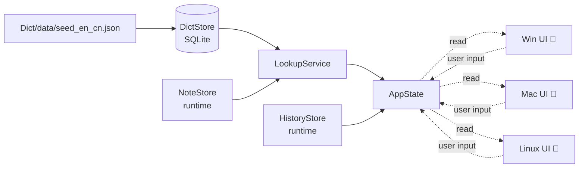
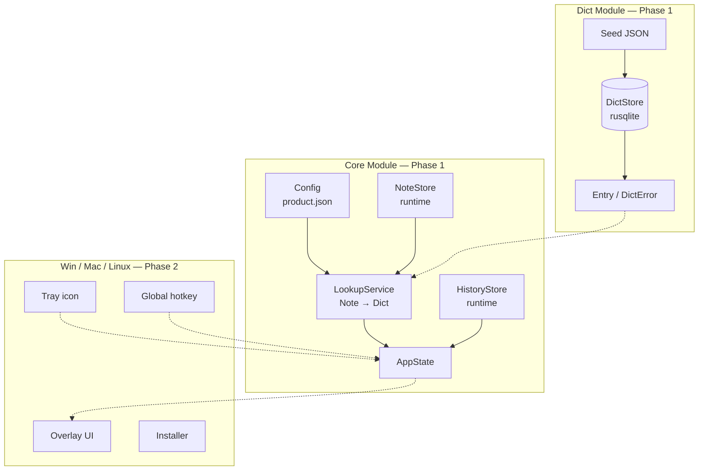

⬇️ [Dict](Dict/.design.md) · [Core](Core/.design.md) · [Skill](Skill/.design.md) · [Agent](Agent/.design.md) · [Win](Win/.design.md) · [Mac](Mac/.design.md) · [Linux](Linux/.design.md)

# EasyEnglish — Design Specification

EasyEnglish is a **modular English → Chinese desktop translator** for Windows / macOS / Linux.
Designed for ambient use: a tray-resident background process exposes a frameless overlay
on a global hotkey; the user types an English word and immediately sees Chinese definitions
(from a bundled offline dictionary) plus any personal annotation they have attached to the
word as a *Note*.

> **Current scope:** Phase 1 focuses on the **Dict** and **Core** modules — the data layer
> and the platform-independent application logic. The Win / Mac / Linux modules exist as
> documented placeholders so future phases plug in without restructuring the repo.

---

## Table of Contents

- [1. System Overview](#1-system-overview)
- [2. Architecture](#2-architecture)
- [3. Technology Stack](#3-technology-stack)
- [4. Top-Level Modules](#4-top-level-modules)

---

## 1. System Overview

EasyEnglish has three responsibilities, layered cleanly:

1. **✅ Offline dictionary access** (`Dict`) — Ship a curated English → Chinese word list,
   load it into SQLite on first run, expose exact + fuzzy lookup.
2. **✅ Application logic** (`Core`) — Compose dictionary lookups with the user's own
   *Notes* (English → arbitrary content), maintain query history, expose an `AppState`
   the platform layers bind a UI to.
3. **🔨 Platform integration** (`Win` / `Mac` / `Linux`) — Tray icon, global hotkey,
   frameless overlay window, native installer (MSI / dmg / AppImage). Stubbed in
   phase 1, filled in phase 2.

---

## 2. Architecture

<strong>High-level architecture diagram</strong>

The dependency direction is strictly downward: **Platforms → Core → Dict**. Dict and Core
have no knowledge of the UI or operating system. This is the same discipline the previous
C++ implementation followed (now in git history at tag `v0.3.0`).

---

## 3. Technology Stack

| Layer | Choice | Rationale |
|---|---|---|
| Language | Rust (edition 2021, MSRV 1.83) | Memory safety, fast build with workspaces, cross-platform from day one |
| Workspace layout | Cargo workspace, one crate per top-level module | Incremental compile only rebuilds the touched crate |
| Persistence | SQLite via `rusqlite` (bundled) | Zero-config, identical schema across platforms |
| Configuration | `product.json` at repo root | Direct port of m2a convention; readable diff |
| Documentation | `.design.md` + `.interface.md` per module | Direct port of m2a convention; humans + AI both follow it |
| Test runner | `cargo nextest` | 3-10× faster than `cargo test`; parallel by default |
| Linker | `rust-lld` on Windows; `clang -fuse-ld=lld` on Linux | 30-50% faster link than the system default |
| CI | **none** (intentional) | Phase 1 quality gates run locally; revisit after phase 2 |

---

## 4. Top-Level Modules

Each entry below has its own `.design.md` and `.interface.md` linked from the navigation
header at the top of this file.

| Module | Phase | Role |
|---|---|---|
| [`Dict`](Dict/.design.md) | 1 ✅ | Offline EN→CN dictionary bundle + SQLite-backed lookup |
| [`Core`](Core/.design.md) | 1 ✅ | App logic: config, lookup orchestration, history, notes, AppState |
| [`Skill`](Skill/.design.md) | 1.5 📐 | **Proposal (iter-015)** — `trait Skill` + `SkillRegistry`; the unit of extension above plain dict lookup (IPA, examples, etymology, …) |
| [`Agent`](Agent/.design.md) | 1.5 📐 | **Proposal (iter-016)** — orchestrator: runs Skills under user-defined `Instructions` (level, region, formality, latency budget), aggregates `Annotation`s into an `AgentResult` |
| [`Win`](Win/.design.md)   | 2 🔨 | Windows: tray, global hotkey, overlay window, MSI installer (placeholder) |
| [`Mac`](Mac/.design.md)   | 2 🔨 | macOS: tray, global hotkey, overlay window, dmg installer (placeholder) |
| [`Linux`](Linux/.design.md) | 2 🔨 | Linux: tray, global hotkey, overlay window, AppImage/deb (placeholder) |

> 📐 = design proposal awaiting review; no implementation yet.
