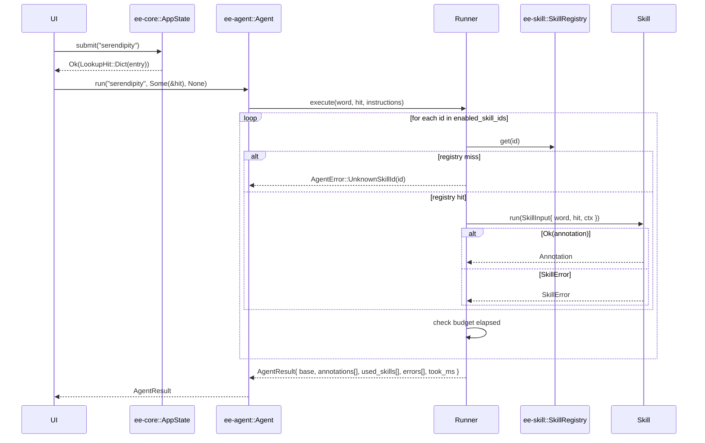

⬆️ [EasyEnglish](../.design.md) · ⬇️ [tests](tests/.test.md)

# Agent Module — Design

> **Status:** **proposal for iter-016**. No implementation yet. Approval of
> this file + `.interface.md` is the gate before any Rust lands.
> Depends on Skill (iter-015) being merged first.

The `Agent` module is the **orchestrator**. Given a word and the dictionary
hit `Core` already produced, the Agent decides *which* `Skill`s from
`SkillRegistry` to run, *in what order*, *under what budget*, and aggregates
their `Annotation`s into a single `AgentResult` the UI renders.

The Agent reads **`Instructions`** — user preferences: CEFR level, region
preference (US / UK / AU / IN), formality, enabled skill ids (which doubles
as run order), latency budget, and a free-form `custom` map for plugin
configuration.

---

## 1. Responsibility

| File | Responsibility |
|---|---|
| `instructions.rs` | `Instructions` struct + `CefrLevel` / `Region` / `Formality` *(the latter three are imported from `ee-skill` and re-exported so callers depend on Agent only)*. `Instructions::default()` and serde round-trip. |
| `runner.rs` | The execution loop: iterate `enabled_skill_ids`, look up in registry, run, time, enforce `latency_budget_ms`, collect annotations vs errors. |
| `agent.rs` | The public `Agent` struct: owns `SkillRegistry` + default `Instructions`, exposes `run()`. |
| `result.rs` | `AgentResult` + serialisation. |

Agent owns no global state. Two `Agent`s with the same registry and same
defaults are functionally indistinguishable.

---

## 2. Architecture

```mermaid
flowchart LR
    subgraph Agent[ee-agent]
        Instr[Instructions]
        Run[Runner<br/>(budget + order)]
        Aggr[Aggregator]
        Agt[Agent]
        Instr --> Run
        Run --> Aggr
        Aggr --> Result[AgentResult]
        Agt --> Run
    end

    Core[ee-core::LookupHit] --> Agt
    Reg[ee-skill::SkillRegistry] --> Agt
    Reg --> Run
    Run -->|run| Sk[(Skills)]
    Sk -->|Annotation / SkillError| Run
```

Hard rules:

- **Agent → Core, Skill.** No edges the other way.
- **Agent never touches UI / OS / network.** Network access lives in
  individual Skills, behind the trait.
- **One owner of `SkillRegistry`.** Once handed to `Agent::new`, the registry
  is fully owned by the Agent. Callers wanting to add a skill mid-life either
  rebuild the Agent or use a future `Agent::register_skill(...)` (out of
  scope for iter-016).

---

## 3. Sequence: enriched lookup



---

## 4. Failure policy

Per-skill failure is **partial success**, not pipeline failure:

| `Skill::run` returns | Runner does |
|---|---|
| `Ok(Annotation)` | Push to `AgentResult.annotations`; record id in `used_skills` |
| `Err(NotApplicable)` | Drop silently. Not in `used_skills`, not in `errors`. |
| `Err(DataSourceUnavailable(s))` | Push to `AgentResult.errors` as `(id, err)`; not in `used_skills` |
| `Err(Cancelled)` | Same as above (already implies budget hit) |
| `Err(Internal(s))` | Same as above; **and** runner emits a `tracing::warn!` |

`AgentError` (pipeline-level) is reserved for misconfiguration that means
the *entire call* cannot proceed:

| `AgentError` variant | Caused by |
|---|---|
| `EmptyWord` | `word.trim().is_empty()` after Agent's own trim |
| `NoSkillsEnabled` | `instructions.enabled_skill_ids` is empty |
| `UnknownSkillId(id)` | Instructions reference a skill the registry doesn't know — fail-fast, do **not** silently skip (caller's mistake). |

> Design tension worth flagging: `UnknownSkillId` as fail-fast vs collected.
> Current choice is fail-fast because Instructions is meant to be validated
> against the registry at the UI layer. If reviewer prefers "ignore unknown
> ids and log", say so and we flip it before iter-016 lands.

---

## 5. Budget enforcement

`latency_budget_ms == 0` → budget disabled (run them all).

`latency_budget_ms > 0` → before each skill call:

```text
if elapsed_since_start_ms >= latency_budget_ms:
    for each remaining id:
        errors.push((id, SkillError::Cancelled))
    break
```

Note: the **currently running** skill cannot be preempted (we have no async
runtime). So the actual wall-time may exceed the budget by *one* skill's
duration. That trade-off is documented in `Instructions.latency_budget_ms`'s
doc comment.

---

## 6. Where do Instructions live?

In Phase 1, **`Instructions` is a struct inside `ee-agent`**, not its own
crate. Rationale:

- It's a plain-data struct (5 enums + 2 scalars + 1 map). No behaviour.
- A standalone crate for one struct adds a build edge for zero benefit.
- The fields share concept-space with `SkillContext` (also a plain-data
  struct in `ee-skill`); duplicating 3 enums between them and re-exporting
  is simpler than introducing a third "prefs" crate.

We will promote `Instructions` to a dedicated `ee-instruction` crate **if**
either of these is true at the end of iter-016:

- Instructions grows real validation logic (e.g. per-skill quotas, scheduled
  disabling, conditional fields).
- A non-Agent consumer needs to read/write Instructions without dragging
  Agent in (currently nothing fits).

A dedicated ADR will record the split if it happens.

---

## 7. Persistence

`Instructions` is `Serialize + Deserialize`. The natural home is `Config`
(in `ee-core`) — we extend `product.json` with an optional `agent` block:

```json
{
  "agent": {
    "level": "B2",
    "region": "US",
    "formality": "Neutral",
    "max_examples": 3,
    "enabled_skill_ids": ["ipa.american", "examples.3", "formality.note"],
    "latency_budget_ms": 1500,
    "custom": {}
  }
}
```

This is **wired but not required**: if the block is absent, `Instructions::default()`
is used. `Config` exposes `agent_instructions() -> Instructions` to keep
JSON shape out of Agent's public surface.

---

## 8. Performance budget

- `Agent::run` overhead (no skills): < 50 µs (single registry lookup per id,
  one allocation for the result vec).
- Per-skill: dominated by the skill itself; Agent adds ~µs of `Instant::elapsed`.
- `Instructions` serialisation: dominated by serde_json, ~tens of µs for a
  fully-populated instance.

---

## 9. Open design questions for reviewer

1. **Fail-fast vs silently-skip on `UnknownSkillId`** — see §4.
2. **Should `run` accept `&mut self` or `&self`?** Plan: `&self` (pure). The
   runner does not mutate Agent state. If we add caching of skill output, it
   moves into a separate `AgentCache` wrapper, not onto `Agent`.
3. **`Instructions::custom` value type** — `BTreeMap<String, String>` is the
   floor. Should it be `serde_json::Value` to allow nested config? Plan:
   start with `String` for stable diff in `product.json`; plugins serialise
   their own json into the string. Open to feedback.
4. **`used_skills` ordering** — chronological (insertion order). Reviewer:
   confirm UI prefers chronological over `enabled_skill_ids` order
   (chronological skips silently-NotApplicable skills; the other order keeps
   them with no annotation).
5. **Concurrency** — none in iter-016. Skills run sequentially. We will
   introduce a `parallel: bool` toggle on Instructions in a later iter if
   measurable latency wins; doing it now would force `Skill: Send + Sync`
   constraints we already plan to require, so the path is open.
6. **Telemetry** — `tracing::info!` per skill call, `warn!` on internal
   errors. No telemetry endpoint shipped. Reviewer: confirm tracing is
   acceptable as an Agent dep.
