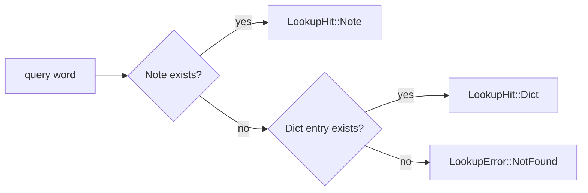

⬆️ [EasyEnglish](../.design.md) · ⬇️ (no nested submodules; everything lives in `src/`)

# Core Module — Design

The `Core` module is the **platform-independent application logic** of EasyEnglish.
It composes the offline `Dict` with user-defined *Notes* and recent-query history,
and exposes an `AppState` that the Win / Mac / Linux platform crates bind UIs to.

> **Phase 1 status:** Implementation lands in iter-014. Phase 1 only asserts the
> module's structure, dependency rules, and Note semantics.

---

## 1. Responsibility

Core owns five orthogonal concerns, each in its own `src/*.rs`:

| File | Responsibility |
|---|---|
| `config.rs` | Read `product.json` at process start, expose typed values |
| `history.rs` | Bounded ring of recent successful lookups (runtime-only) |
| `notes.rs` | User-defined "English → arbitrary content" mapping (runtime-only) |
| `lookup.rs` | `LookupService` — query order is **Note → Dict → NotFound** |
| `state.rs` | `AppState` — model the platform crates' UI reads/writes each frame |

Core does **not** know about: SQLite (delegates to `Dict`), UI, OS APIs, networking.
Its only platform-y dependency is the `directories` crate, used by `Config` to locate
the user data directory in a cross-platform way.

---

## 2. Note Semantics (new in this rewrite)

A *Note* is the user's own annotation for an English word. It is **not** a translation
contract — the user can attach anything: a custom translation, a mnemonic, a URL, a
sentence template.

| Property | Behavior |
|---|---|
| Key | `word`, lower-cased; case-insensitive on lookup |
| Value | `content: String`, arbitrary UTF-8 |
| Lifetime | **runtime only** in Phase 1 — `NoteStore::new()` starts empty, drops on process exit |
| Conflict resolution | `set(word, content)` overwrites silently; `remove(word)` is idempotent |
| Persistence | Phase 1: none. Phase 2 may add `persist_to(path)` without breaking the trait |

This replaces v0.3.0's `FavoritesStore`. A "favorite" is just an empty-content Note
in the new model; or the user can attach a private translation to override the dictionary.

---

## 3. Lookup Order



Notes are intentionally checked first so the user can permanently override a dictionary
entry without ever editing the dictionary file. The `prefer_notes_over_dict` flag in
`product.json` exists to flip the order to "Dict first, then Note" if a future user
wants the opposite — but in Phase 1 it is wired and defaulted to `true`.

---

## 4. Data Lifecycle

```mermaid
sequenceDiagram
    participant UI as Platform UI (future)
    participant AS as AppState
    participant LS as LookupService
    participant NS as NoteStore
    participant DS as DictStore
    participant HS as HistoryStore

    UI->>AS: input_mut() = "apple" ; submit()
    AS->>LS: query("apple")
    LS->>NS: get("apple")
    NS-->>LS: None
    LS->>DS: lookup("apple")
    DS-->>LS: Ok(Entry{..})
    LS-->>AS: Ok(LookupHit::Dict(Entry))
    AS->>HS: record("apple")
    AS-->>UI: last_hit() = Some(LookupHit::Dict(..)), status="found"
```

---

## 5. Failure Modes

| Source | Surfaces as |
|---|---|
| `Dict::lookup` returning `NotFound` and no matching Note | `LookupError::NotFound`; AppState clears `last_hit`, status = "not found: <word>" |
| `Dict::lookup` returning `Storage` (rare: db file deleted underneath us) | `LookupError::Storage(_)`; AppState sets status accordingly, keeps prior `last_hit` |
| Empty / whitespace-only input | `AppState::submit()` is a no-op (no state change, no error) |

Phase 2 may add an online dictionary as a third tier; the `LookupService` trait will
extend, not break.

---

## 6. Performance budget

- `NoteStore::get` / `set` / `remove`: O(1) on a `HashMap<String, Note>`
- `HistoryStore::record`: O(1) amortised; bounded by `core.history.max_entries` in `product.json` (default 50)
- `LookupService::query`: dominated by `DictStore::lookup` (~1 ms); Note check is a hash lookup
