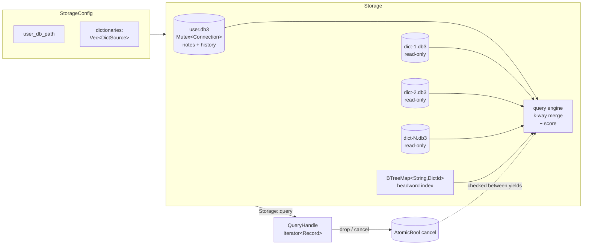
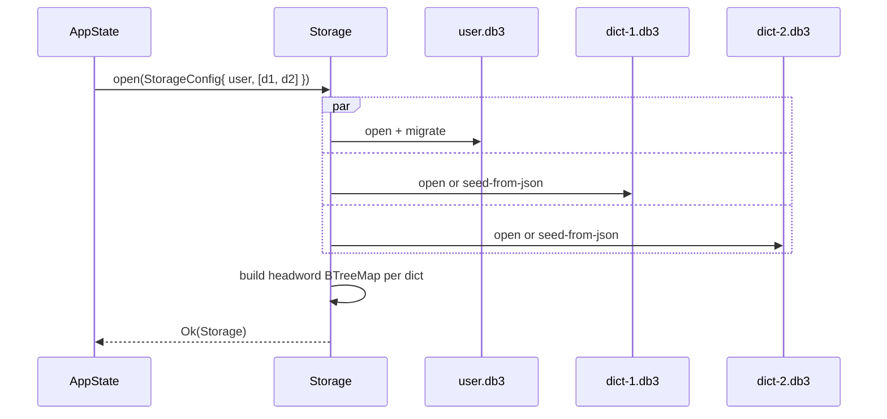
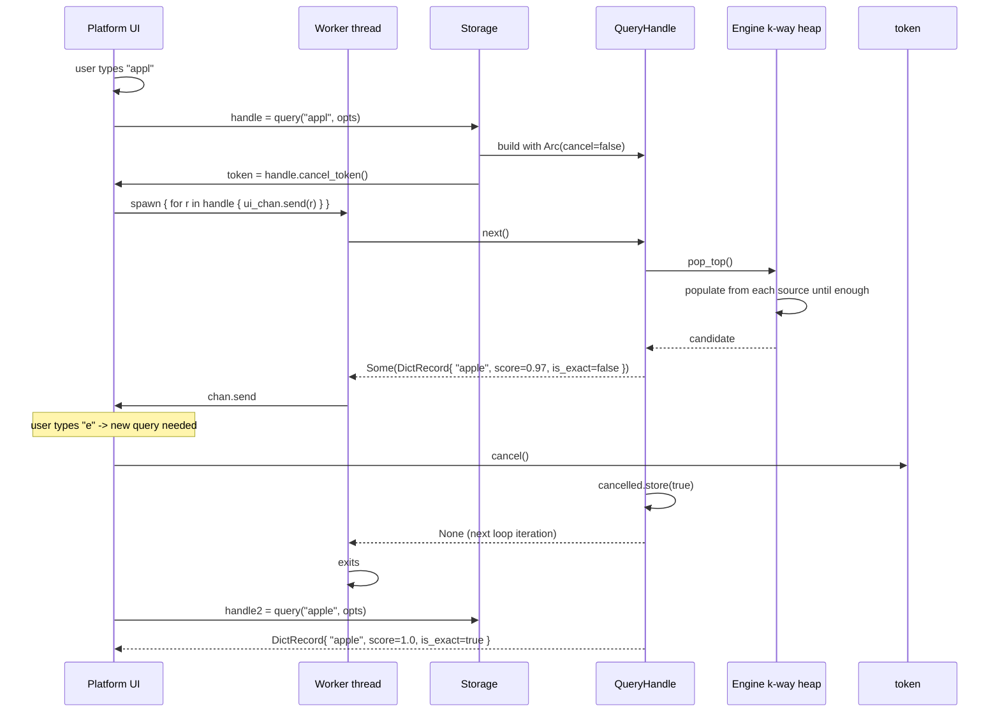

⬆️ [Core](../../.design.md) · ⬇️ [interface](.interface.md) · [tests](.test.md)

# Core::storage Sub-Module — Design (v2)

> **Status:** **proposal v2 for iter-015-core-storage**. Supersedes v1
> (commit `31141f0`). No implementation yet. Approval of this file +
> `.interface.md` + `.test.md` is the gate before any Rust lands.

---

## 0. What changed from v1 (and why)

The v1 design was thrown out after a single user note:

> *"任何查询都应该是模糊的，可以随时取消的操作，返回的结果应该是动态更新的结构，
> 返回一种通用的 base record 结构…第一次加载的时候，应该是可以加载多个离线字典."*

That collapses v1's surface in five directions at once. The five new
constraints — and how this design honours each:

| Constraint | v2 response |
|---|---|
| **All queries are fuzzy** | Delete `dict_lookup` / `notes_get` / `dict_suggest`. Single entry point: `Storage::query(term, opts)`. |
| **Cancellable at any time** | Return a `QueryHandle` that owns an `Arc<AtomicBool>` cancel flag. `Drop` cancels (RAII). Separate `CancelToken` is `Clone` for cross-thread cancel. |
| **Dynamically-updating results** | `QueryHandle` impls `Iterator<Item = Record>`. Callers pull next record as it is produced; partial result sets are first-class. |
| **Common base record + downcast** | `enum Record { Dict(DictRecord), Note(NoteRecord), History(HistoryRecord) }`, every variant carries a `BaseRecord` shared struct with `is_exact: bool`, `score: f32`, `matched_word: String`, `kind: RecordKind`. Pattern-match or `record.as_dict()` to downcast. |
| **Multiple offline dictionaries** | `StorageConfig { dictionaries: Vec<DictSource>, user_db_path }`. Each dictionary loads as its own read-only SQLite file (cached from a JSON seed or pre-built). `Storage` k-way-merges across all of them at query time. |

---

## 1. Responsibility

`Core::storage` is the **only** module that knows about persistence and the
**only** producer of `Record` instances. It owns:

| File / table | Purpose | Mutability |
|---|---|---|
| 1..N dict files (one per `DictSource`) | Cached dictionary entries + per-dict metadata | Read-only after seed |
| 1 user file (`user.db3`) | `notes` + `history` + `schema_version` | Read-write |
| In-memory `BTreeMap<String, ()>` (per dict) of headwords | Source of fuzzy candidates without full table scan | Rebuilt on open |

`Core::storage` knows nothing about: UI, `Config`, networking, threading
policy beyond `Send + Sync`. It exposes a synchronous, pull-based query
contract; the platform crate decides whether to drive the iterator on the
main thread, a worker thread, or a pool.

---

## 2. Architecture



Hard rules:

- Exactly **one** `Mutex<Connection>` per file (one for user, one per dict).
- Dict files are opened **read-only** after seed.
- No `Storage::open` succeeds with zero dictionaries — `StorageConfig` must
  carry at least one `DictSource`. (User-only deployments are nonsensical
  for a translator.) Open question §13 q.5.

---

## 3. Record model

This is the centrepiece of v2 — everything else exists to produce these.

```text
                    ┌───────────────────┐
                    │  Record (enum)    │
                    └────────┬──────────┘
              ┌──────────────┼──────────────┐
              ▼              ▼              ▼
       DictRecord     NoteRecord    HistoryRecord
              │              │              │
              └──────────────┼──────────────┘
                             ▼
                       BaseRecord {
                         query_term,        // what the user typed
                         matched_word,      // canonical word in source
                         is_exact,          // case-insensitive equality
                         score,             // 0.0..=1.0
                         kind,              // tag duplicating the variant
                       }
```

Why an enum (not a trait + `Box<dyn Record>`):

- Closed set: dict, note, history are the only producers. New producers
  (e.g. online dict in Phase 2) add a variant in one place; callers' `match`
  arms get a compiler-enforced reminder.
- Zero vtable overhead in hot path.
- "Downcast" is just `record.as_dict() -> Option<&DictRecord>` — readable,
  exhaustive when needed (`match`), opt-in when not (`as_*` accessors).

Why a separate `BaseRecord` struct (not flat fields on each variant):

- Mechanical guarantee that every variant carries the same five base
  attributes — drift impossible.
- `Record::base(&self) -> &BaseRecord` lets generic UI code render score /
  exactness without matching on kind.

---

## 4. Query semantics

### 4.1 Inputs

```rust
pub struct QueryOptions {
    /// Filter sources. Default: include all.
    pub include_dict:    bool,
    pub include_notes:   bool,
    pub include_history: bool,

    /// If Some, restrict dict results to these dict ids (in priority order).
    /// None = all loaded dicts.
    pub dict_ids:        Option<Vec<String>>,

    /// Records below this score are dropped, never yielded.
    /// Default: 0.0 (yield everything; UI filters).
    pub min_score:       f32,

    /// Per-source cap. None = unlimited. Default: Some(50).
    pub max_per_source:  Option<usize>,

    /// Behaviour for the very first yield:
    /// `BlockUntilExactOrFirst` (default) — block until either the exact-match
    ///   record is found OR every source has produced at least one record,
    ///   whichever happens first. Lets the UI snap to the exact match without
    ///   showing fuzzy noise.
    /// `YieldAsFound` — yield records in score-desc order as produced.
    pub first_yield_policy: FirstYieldPolicy,
}
```

### 4.2 Output: `QueryHandle`

```rust
pub struct QueryHandle { /* opaque */ }

impl Iterator for QueryHandle { type Item = Record; ... }
impl Drop     for QueryHandle { fn drop(&mut self) { self.cancel(); } }

impl QueryHandle {
    pub fn cancel(&self);
    pub fn is_cancelled(&self) -> bool;
    pub fn query_term(&self) -> &str;
    pub fn cancel_token(&self) -> CancelToken;     // Clone, Send, Sync
    pub fn stats(&self) -> QueryStats;             // produced / dropped / per-source counts
}

#[derive(Clone)]
pub struct CancelToken { /* Arc<AtomicBool> */ }
impl CancelToken {
    pub fn cancel(&self);
    pub fn is_cancelled(&self) -> bool;
}
```

### 4.3 Cancellation semantics

- `Storage::query` allocates an `Arc<AtomicBool> cancelled` (initial false).
- Every source yields are produced lazily; before producing each next record
  the engine checks `cancelled.load(Acquire)`. If true → return None.
- `QueryHandle::cancel()` flips the flag. Idempotent.
- `Drop for QueryHandle` calls `cancel()`. RAII so a worker thread that
  drops the handle without explicit cancel still stops the underlying work.
- `cancel_token()` returns a clone of the flag so the UI can fire-and-forget
  the handle onto a worker thread and still cancel from the main thread.

> Phase 1 is single-threaded inside `query()` itself — sources are walked
> sequentially in `.next()`. Concurrent source-walking is a future
> optimisation; see §13 q.6.

### 4.4 Ordering across sources

For each source, the engine maintains a lazily-populated `BinaryHeap` of
(score, candidate) pairs. `QueryHandle::next` performs a single k-way pop
of the highest-score candidate across heaps, materialises the corresponding
`Record`, and returns it.

`first_yield_policy = BlockUntilExactOrFirst` (default): the first yield is
delayed until either (a) the exact-match record is found by *any* source, or
(b) every requested source has emitted at least one record. Whichever is
sooner. This single special-case makes the typical UI experience snap to
exact match without showing 5 fuzzy distractions first.

### 4.5 Scoring

For a query `q` and a candidate matched word `w`:

```
score = max(
    1.0                                          if q.lower() == w.lower(),
    0.95                                         if w.lower().starts_with(q.lower()),
    1.0 - (lev(q.lower(), w.lower()) / max(|q|, |w|))    otherwise
)
clamped to [0.0, 1.0]
```

Exact match always wins (1.0). Prefix match comes second (0.95). Levenshtein
distance fills in the long tail. Identical formula across sources to keep
ordering meaningful across dict / note / history.

`is_exact = (score >= 1.0)` — single source of truth, no separate path.

---

## 5. Multi-dictionary architecture

### 5.1 Configuration

```rust
pub struct StorageConfig {
    /// User database (notes + history). None == in-memory user db.
    pub user_db_path: Option<PathBuf>,

    /// At least one. Priority = vector order (first = highest).
    pub dictionaries: Vec<DictSource>,
}

pub struct DictSource {
    /// Stable id for cross-referencing (e.g. in QueryOptions.dict_ids).
    /// Convention: kebab-case, no slashes, e.g. "ee-builtin", "cc-cedict".
    pub id: String,

    /// One of:
    /// - SeededJson { json_path, cache_path } — on first open, seed
    ///   cache_path from json_path. Reuse cache on subsequent opens.
    /// - Sqlite { path } — open existing SQLite (must be schema-compatible).
    pub origin: DictOrigin,

    /// Human-readable name shown in UI ("Built-in 245 words").
    pub display_name: String,
}

pub enum DictOrigin {
    SeededJson { json_path: PathBuf, cache_path: PathBuf },
    Sqlite     { path: PathBuf },
}
```

### 5.2 Lifecycle



`Storage::open` may parallelise per-source opens (rayon / std::thread). Not
required for correctness; a future optimisation.

### 5.3 Per-dict schema (each dict file)

```sql
CREATE TABLE entries (
    headword TEXT PRIMARY KEY COLLATE NOCASE,
    phonetic TEXT NOT NULL DEFAULT '',
    definitions TEXT NOT NULL  -- JSON array
);
CREATE INDEX idx_entries_headword_nocase ON entries(headword COLLATE NOCASE);

CREATE TABLE meta (
    key TEXT PRIMARY KEY,
    value TEXT NOT NULL
);
-- Required keys: source_id (= DictSource.id), display_name, schema_version, seed_hash

CREATE TABLE schema_version (
    version INTEGER PRIMARY KEY,
    applied_at INTEGER NOT NULL
);
```

### 5.4 User-db schema

```sql
CREATE TABLE notes (
    word TEXT PRIMARY KEY COLLATE NOCASE,
    content TEXT NOT NULL,
    created_at INTEGER NOT NULL,
    updated_at INTEGER NOT NULL
);

CREATE TABLE history (
    id INTEGER PRIMARY KEY AUTOINCREMENT,
    word TEXT NOT NULL COLLATE NOCASE,
    recorded_at INTEGER NOT NULL,
    source_kind TEXT NOT NULL,    -- 'dict' | 'note'  (what the user picked)
    source_ref TEXT                -- dict_id when source_kind='dict', NULL for 'note'
);
CREATE INDEX idx_history_recorded_at ON history(recorded_at DESC);

CREATE TABLE schema_version (
    version INTEGER PRIMARY KEY,
    applied_at INTEGER NOT NULL
);
```

Each file gets PRAGMAs: WAL, synchronous=NORMAL, foreign_keys=ON, busy_timeout=5000.

---

## 6. Failure model

| Variant | When |
|---|---|
| `StorageError::Io(io::Error)` | OS-level file open / create / lock |
| `StorageError::Sqlite(rusqlite::Error)` | Any SQL op after open |
| `StorageError::SeedRead(io::Error)` | DictOrigin::SeededJson, json file unreadable |
| `StorageError::SeedParse(serde_json::Error)` | DictOrigin::SeededJson, malformed json |
| `StorageError::DictIdConflict(String)` | Two `DictSource`s share an id |
| `StorageError::DictIdNotFound(String)` | `QueryOptions.dict_ids` references unknown id |
| `StorageError::Migration { from, to, source, reason }` | Schema version mismatch can't be reconciled |
| `StorageError::Corruption(String)` | Invariant violated (e.g. dict file exists but `entries` table missing) |
| `StorageError::InvalidInput(String)` | Empty word to `notes_set`, etc. |
| `StorageError::EmptyConfig` | `StorageConfig.dictionaries.is_empty()` and feature isn't allowed (§13 q.5) |

`Storage::query` does NOT return Result — it always returns a `QueryHandle`.
Errors that surface mid-iteration are folded into the handle's stats
(`QueryStats.errors_per_source: Vec<(String, StorageError)>`) and the next()
returns None when no more results are reachable.

Rationale: cancelling a query mid-stream because one of 5 dicts had a
transient SQL error would be hostile UX.

---

## 7. Sequence: end-to-end fuzzy query



---

## 8. Mutations (writes)

Writes are NOT queries — they target a specific word; fuzziness doesn't apply.

```rust
pub fn notes_set(&self, word: &str, content: &str) -> Result<NotesSetOutcome, StorageError>;

pub enum NotesSetOutcome { Created, Updated }

pub fn notes_remove(&self, word: &str) -> Result<bool, StorageError>;
pub fn history_record(&self, word: &str, source_kind: SourceKind, source_ref: Option<&str>, max_entries: usize) -> Result<(), StorageError>;
pub fn history_clear(&self) -> Result<(), StorageError>;
```

`history_record` requires `source_kind` and `source_ref` so the UI can replay
"you looked up *apple* via dict `cc-cedict`" later. `source_ref` is the
`DictSource.id` for `Dict`; `None` for `Note`.

`notes_set` returning `Created` vs `Updated` removes the need for a separate
existence check (which would itself violate "no exact queries").

---

## 9. Non-query reads (metadata + enumeration)

```rust
pub fn dict_ids(&self) -> Vec<String>;
pub fn dict_meta(&self, id: &str) -> Option<DictMeta>;     // owned snapshot
pub fn dict_entry_count(&self, id: &str) -> Result<usize, StorageError>;
pub fn notes_count(&self) -> Result<usize, StorageError>;
pub fn history_count(&self) -> Result<usize, StorageError>;

pub fn notes_iter(&self) -> NotesIter;        // alpha order, plain Iterator
pub fn history_iter(&self) -> HistoryIter;    // most-recent-first, plain Iterator
```

`notes_iter` and `history_iter` are **management views** (for "manage notes"
screens), not search. They are plain iterators, not cancellable, not scored
— they walk SQLite cursors and yield `Note` / `HistoryEntry` directly.

`DictMeta` is owned (`String` not `&str`) so callers don't hold references
into the connection.

---

## 10. Concurrency model

- `Storage`: `Send + Sync`. Internal: one `Mutex<Connection>` per file.
- `QueryHandle`: `Send` (a worker can own it); **not** `Sync` (one consumer
  per handle; that's the iterator contract).
- `CancelToken`: `Send + Sync + Clone`. Cheap to clone (`Arc` bump).
- All read methods (`query`, `notes_iter`, counts, …) take `&self`. Writes
  also take `&self` — internal mutex serialises.
- `Arc<Storage>` is the recommended shared-ownership form; the AppState
  holds one and may clone it onto worker threads.

---

## 11. Migration policy

Same as v1 §8, but **per file**. Each dict file and the user file maintain
their own `schema_version`. `Storage::open` walks them independently. A
single source's migration failure aborts the whole `open` and rolls back
just that source's transaction.

`schema_versions(&self) -> SchemaVersions { user: u32, dicts: Vec<(String, u32)> }` is the inspector.

---

## 12. Migration from current Core (iter-014 frozen)

Three iters, same shape as v1 §12 — but the v2 surface change is bigger:

| Iter | Scope | Risk |
|---|---|---|
| **iter-015-core-storage** | Implement `Core::storage` v2 (this design). Keep old `NoteStore` / `HistoryStore` as `#[deprecated]` thin facades around `Storage` calls. | Med — much bigger surface than v1, more tests |
| **iter-016-retire-ee-dict** | Move existing `seed_en_cn.json` into a `DictSource { id: "ee-builtin", origin: SeededJson { ... } }`. Delete the `ee-dict` crate. Rewire `LookupService` to use `Storage::query`. | Med — cross-cutting |
| **iter-017-drop-deprecated** | Remove deprecated `NoteStore` / `HistoryStore`. Caller code uses `Storage` and `Record` directly. Re-freeze `Core::interface.md`. | Low |

Per `AGENTS.md` §5, ADR `docs/adr/0005-storage-merge.md` lands with
iter-015-core-storage, not now.

---

## 13. Open design questions for reviewer

1. **`enum Record` vs `trait Record + dyn`.** Plan: enum (see §3). Confirm.
   Trait + dyn buys plugin-defined record types in Phase 2 but adds a
   vtable hop on the hot path; enum keeps it cheap and exhaustive.

2. **`BaseRecord.score: f32` formula.** Plan: max(exact 1.0, prefix 0.95,
   1 − norm(Levenshtein)) per §4.5. Alternatives: Jaro-Winkler, n-gram. If
   you'd rather a different formula, name it before iter-015.

3. **`is_exact` semantics.** Plan: `score >= 1.0` ⇔ `query.lower() ==
   matched.lower()`. Alternative: diacritic-fold ("naïve" ≡ "naive"). Plan
   says **no** in Phase 1; open to override.

4. **`FirstYieldPolicy::BlockUntilExactOrFirst` default.** Plan: yes. It
   makes exact matches snap to position 1 in the UI without showing fuzzy
   distractions. Tradeoff: marginal first-result latency (≤ ~5 ms typical).
   Alternative default: `YieldAsFound`.

5. **Zero-dictionary deployments.** Plan: refuse with `EmptyConfig`. A
   translator with no dictionaries can't translate. Alternative: allow, so
   user can run notes-only (e.g. as a personal phrasebook).

6. **Concurrent source-walking inside `query()`.** Plan: sequential in
   Phase 1 (each `next()` synchronously merges from sources). Phase 2 may
   spawn one thread per source feeding into the central heap. Sequential
   is simpler; concurrent shaves milliseconds at 5+ dicts. Sequential is
   the plan unless you push back.

7. **Record dedup across dicts.** Plan: no dedup. If both `ee-builtin` and
   `cc-cedict` define `apple`, you get two `DictRecord`s. UI can dedup if
   it wants. Alternative: storage dedups by canonical headword, returning
   one record with a Vec of (dict_id, definitions). Adds complexity to
   `DictRecord`; defer.

8. **`history_record` capturing `source_kind` + `source_ref`.** Plan: yes
   (UI can show provenance). Alternative: just record `word`. The richer
   form costs 2 columns and zero CPU.

9. **Cache file path for SeededJson dicts.** Plan: caller provides
   `cache_path` explicitly in `DictOrigin::SeededJson`. Alternative: derive
   from `json_path + ".db3"`. Explicit is simpler to reason about across
   OSes; convention-over-config saves config lines.

10. **`QueryHandle: !Sync` deliberately.** Plan: one consumer per handle
    (iterator contract). The shareable thing is `CancelToken`. Confirm
    this matches your mental model of how the UI / worker split works.

11. **Notes are **finally** persisted.** This v2 design (like v1) reverses
    Phase 1's runtime-only Note semantics. Per the iter-013 conversation
    you asked for runtime-only. Confirm reversal is intentional.

12. **Score type: `f32` vs `f64` vs typed wrapper.** Plan: `f32`,
    documented [0.0, 1.0]. Alternative: `Score(u16)` with 0..=10000 for
    deterministic ordering (no NaN, no `PartialOrd` warts). `f32` is
    enough precision for ranking; `Score` is nicer for `Ord`. Open.

13. **`notes_iter` and `history_iter` as separate iterators.** Plan: yes,
    they're enumeration, not search. Alternative: overload `query` with an
    `all-of-source` mode. Plan keeps the two concepts separate;
    overloading was tempting but bad for clarity.
