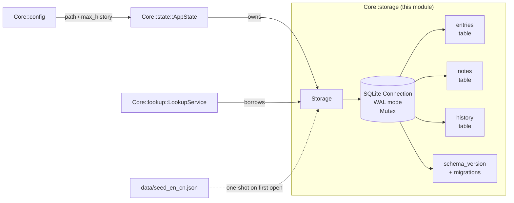

⬆️ [Core](../../.design.md) · ⬇️ [interface](.interface.md) · [tests](.test.md)

# Core::storage Sub-Module — Design

> **Status:** **proposal for iter-015-core-storage**. No implementation yet.
> Approval of this file + `.interface.md` + `.test.md` is the gate before any
> Rust lands.
>
> **Layout note:** This is a *sub-module* of the `ee-core` crate, not a new
> top-level workspace member. The standard m2a 3-file layout
> (`.design.md` / `.interface.md` / `tests/.test.md`) is adapted: the three
> doc files live adjacent to the future source in `Core/src/storage/`, and the
> actual `#[test] fn`s land in `Core/tests/test_storage*.rs` (per Rust's
> integration-test convention).

---

## 0. Why this exists (the redesign motive)

The current `ee-core` (frozen iter-014) keeps `notes.rs` and `history.rs`
**runtime-only** — every restart wipes them. Dictionary persistence lives in
a *separate* crate (`ee-dict`) with its own SQLite handle. The frozen surface
worked for Phase 1 but has three growing pains:

1. **Notes are ephemeral.** Real users won't tolerate losing custom
   translations on restart. Phase 1 deferred this; we now have to add it.
2. **Two unrelated SQLite connections** (one in `ee-dict`, one future in
   notes/history) means duplicate config, two file locks, two migration
   scripts, no cross-store transactions.
3. **`ee-core` and `ee-dict` are not actually independent.** Every consumer
   already pulls both. The split made sense before notes/history grew up;
   it's becoming a tax.

The fix is a single `storage` sub-module inside `ee-core` that owns *all*
persistent state — dictionary, notes, history — behind one connection, one
file, one schema-version counter, one migration story.

---

## 1. Responsibility

`Core::storage` owns persistence. Three concerns, one connection:

| Sub-concern | Owns | Replaces |
|---|---|---|
| Dictionary | `entries` table — read-mostly, populated from `seed_en_cn.json` on first open | `ee-dict::DictStore` (see §12 for retirement plan) |
| Notes      | `notes` table — read/write user EN→arbitrary-content mappings | `Core::notes::NoteStore` (runtime HashMap retired) |
| History    | `history` table — bounded log of recent successful lookups | `Core::history::HistoryStore` (runtime VecDeque retired) |

`Core::storage` knows nothing about: UI, OS APIs (beyond file paths it
receives), networking, `Config`. It is a leaf module; callers wire it.

---

## 2. Architecture



Single owner: `AppState` constructs exactly one `Storage` and hands
references to other Core services. No one else opens the database.

---

## 3. Schema

```sql
-- v1 — initial. All tables created in one transaction at create time.

CREATE TABLE entries (
    headword     TEXT PRIMARY KEY COLLATE NOCASE,
    phonetic     TEXT NOT NULL DEFAULT '',
    definitions  TEXT NOT NULL                -- JSON array of CN strings
);
CREATE INDEX idx_entries_headword_nocase ON entries(headword COLLATE NOCASE);

CREATE TABLE notes (
    word         TEXT PRIMARY KEY COLLATE NOCASE,   -- canonical lowercased
    content      TEXT NOT NULL,
    created_at   INTEGER NOT NULL,            -- unix epoch seconds
    updated_at   INTEGER NOT NULL
);
CREATE INDEX idx_notes_word_nocase ON notes(word COLLATE NOCASE);

CREATE TABLE history (
    id           INTEGER PRIMARY KEY AUTOINCREMENT,
    word         TEXT NOT NULL COLLATE NOCASE,
    recorded_at  INTEGER NOT NULL
);
CREATE INDEX idx_history_recorded_at ON history(recorded_at DESC);

CREATE TABLE schema_version (
    version      INTEGER PRIMARY KEY,
    applied_at   INTEGER NOT NULL
);
INSERT INTO schema_version (version, applied_at) VALUES (1, strftime('%s','now'));

PRAGMA journal_mode = WAL;       -- enables concurrent readers + single writer
PRAGMA foreign_keys = ON;        -- defensive (no FKs in v1 but harmless)
PRAGMA synchronous = NORMAL;     -- WAL-appropriate durability/perf balance
```

Future migrations are pure-SQL functions registered in
`src/storage/migrations.rs`; see §8.

---

## 4. Sequence: cold-start

```mermaid
sequenceDiagram
    participant App as AppState
    participant Cfg as Config
    participant S as Storage
    participant FS as File system
    participant Seed as data/seed_en_cn.json

    App->>Cfg: load("product.json")
    Cfg-->>App: Config { storage_path, seed_path, history_max }
    App->>S: create_or_open(storage_path, seed_path)
    alt file does not exist
        S->>FS: create file
        S->>S: CREATE TABLE * ; PRAGMA *
        S->>Seed: read JSON
        S->>S: INSERT entries (batch in one tx)
        S->>S: INSERT schema_version 1
    else file exists
        S->>FS: open file
        S->>S: SELECT max(version) FROM schema_version
        opt migration needed
            S->>S: apply migrations in single tx
        end
    end
    S-->>App: Ok(Storage)
```

## 5. Sequence: lookup (warm)

```mermaid
sequenceDiagram
    participant U as UI
    participant App as AppState
    participant L as LookupService
    participant S as Storage

    U->>App: submit("apple")
    App->>L: query("apple", &storage, prefer_notes=true)
    L->>S: notes_get("apple")
    alt Note exists
        S-->>L: Some(Note)
        L-->>App: LookupHit::Note
    else
        S-->>L: None
        L->>S: dict_lookup("apple")
        alt Entry exists
            S-->>L: Some(Entry)
            L-->>App: LookupHit::Dict
        else
            S-->>L: None
            L-->>App: Err(LookupError::NotFound)
        end
    end
    opt hit
        App->>S: history_record("apple")
        S->>S: BEGIN ; INSERT history ; prune to max ; COMMIT
    end
```

---

## 6. API surface (overview — exact sigs live in `.interface.md`)

`Storage` is one struct with **path-scoped methods** grouped by concern:

| Group | Methods | Notes |
|---|---|---|
| Lifecycle | `open` · `create_or_open` · `in_memory` · `in_memory_with_seed` · `path` · `schema_version` | `create_or_open` is the happy path; `open` errors if absent |
| Dictionary | `dict_lookup` · `dict_suggest` · `dict_count` | Read-only after seed |
| Notes | `notes_set` · `notes_get` · `notes_remove` · `notes_list` · `notes_count` | All case-insensitive on `word` |
| History | `history_record` · `history_recent(max)` · `history_clear` · `history_count` | `record` dedups: same-word-as-latest just updates `recorded_at` and re-orders |

No transactions exposed to callers. Each method is a complete unit-of-work.
If we ever need cross-method atomicity, we'll add `Storage::with_tx(|tx| ...)`
in a later iter, behind an ADR.

---

## 7. Concurrency model

- `Storage` is `Send + Sync`.
- Internally: `std::sync::Mutex<rusqlite::Connection>` plus WAL.
- Multiple `Arc<Storage>` clones across threads is supported; SQLite WAL
  permits concurrent readers, one writer. The Mutex serialises all access
  in *this* process (deliberately conservative — SQLite serialisation
  inside one process is itself process-local).
- **No async.** Phase 1 is sync throughout. If we ever introduce a worker
  thread for slow LLM calls, it gets its own `Arc<Storage>` clone.

---

## 8. Schema migration policy

- Current version is a compile-time constant `CURRENT_SCHEMA_VERSION: u32`.
- On `open`, read `MAX(version) FROM schema_version`.
  - `== CURRENT`: no-op.
  - `< CURRENT`: apply each missing migration in order, in one outer
    transaction. On any failure: rollback, return `StorageError::Migration`.
  - `> CURRENT`: refuse to open. Return `StorageError::Migration{from, to,
    reason: "database from newer version"}`. User must upgrade the binary.
- Migrations are **forward-only**. No downgrade path. Downgrades are
  handled by the user restoring a backup file.
- Each migration is a `fn(&mut Connection) -> Result<(), rusqlite::Error>`
  registered in a static slice. v1 is "create everything"; v2+ append.

---

## 9. Failure model

| Variant | When |
|---|---|
| `StorageError::Io(std::io::Error)` | File create / open at OS level fails |
| `StorageError::Sqlite(rusqlite::Error)` | Any SQL operation fails after open |
| `StorageError::SeedRead(std::io::Error)` | First-open: seed JSON file unreadable |
| `StorageError::SeedParse(serde_json::Error)` | First-open: seed JSON malformed |
| `StorageError::Migration { from, to, reason }` | Schema mismatch can't be reconciled |
| `StorageError::Corruption(String)` | Schema row count == 0, or invariant violated |
| `StorageError::InvalidInput(String)` | Caller passed e.g. empty word to `notes_set` |

Every method returns `Result<_, StorageError>`. No panics on user input.

---

## 10. Performance budget

- `notes_get` / `dict_lookup`: one prepared statement, indexed PK lookup —
  sub-ms on warm cache, ~1 ms cold.
- `dict_suggest`: in-memory cached headword list + Levenshtein (current
  ee-dict approach, ported) — < 10 ms for 1000-word dict.
- `history_record`: 1 SELECT + 1 INSERT (or UPDATE) + 1 DELETE-for-prune
  inside one tx — ~2 ms on SSD.
- `create_or_open` cold (fresh DB, ~245 seed entries): ~50 ms (one tx).
- `open` warm: ~5 ms (file open + version check).

---

## 11. Dependency rule

- `Core::storage` depends on: `rusqlite` (bundled), `serde` / `serde_json`,
  `thiserror`, `std`.
- `Core::storage` does **not** depend on: `Core::config`, `Core::state`,
  `Core::lookup`, anything UI, any platform crate.
- `Core::config` depends on storage **only at AppState level** — `Config`
  itself never imports `Storage`. AppState reads paths from Config, then
  constructs Storage.
- `Core::lookup::LookupService` accepts `&Storage` as an arg (no internal
  ownership) — preserves its current statelessness.

---

## 12. Migration path from current architecture

This redesign **breaks the frozen iter-014 interface** of `ee-core` and
**retires the `ee-dict` workspace member**. Per `AGENTS.md` §5, breaking
frozen contracts requires an ADR. The ADR (`docs/adr/0005-storage-merge.md`)
must land *with* the implementation iter (iter-015-core-storage), not now.

Migration plan, in three iters:

| Iter | Scope | Risk |
|---|---|---|
| **iter-015-core-storage** | Implement `Core::storage` (this design). Rewrite `Core::notes` and `Core::history` as thin facades over `Storage` for one release, marked `#[deprecated]`. | Low — additive, doesn't touch ee-dict yet |
| **iter-016-retire-ee-dict** | Move `Dict/data/seed_en_cn.json` → `Core/data/seed_en_cn.json`. Delete `ee-dict` crate. Remove it from `Cargo.toml` workspace members. Update root `.design.md` / `.interface.md`. Update `LookupService` to use `Storage::dict_lookup` directly. | Medium — single PR but cross-cuts the workspace |
| **iter-017-drop-deprecated** | Remove `Core::notes::NoteStore` and `Core::history::HistoryStore` types; callers now use `Storage` directly via `AppState`. Re-freeze `Core::interface.md`. | Low — pure cleanup |

User must approve this overall arc before iter-015 work starts.

---

## 13. Open design questions for reviewer

1. **Retire `ee-dict` or keep it?** (Pivotal.)
   - **(a) Retire** — my recommendation. One persistence layer, one tx
     boundary, one file, one mental model. Costs: ADR + ~200 LOC of
     migration code + one workspace member removed.
   - **(b) Keep** — `Core::storage` wraps `ee-dict::DictStore` internally
     for the entries table. Saves migration work; preserves the "dict is a
     crate" boundary. Costs: two connections, two locks, two migration
     stories, mental tax.
   - I drafted §3/§4 assuming (a). Pick (b) and I rewrite §3/§4/§12 in
     iter-015-core-storage's design instead of touching code.

2. **One database file vs two?**
   - One `storage.db3` containing all three tables (current plan).
   - Two: `bundled.db3` (read-only, shipped with installer, holds entries)
     + `user.db3` (read/write, holds notes + history). Pro: backup user.db3
     trivially; upgrade dict without losing notes. Con: two connections, no
     cross-table tx.
   - Current plan: **one file**, dictionary seeded *into* it on first run
     from the shipped JSON. Upgrades replace entries via a UPSERT migration
     keyed on schema_version.

3. **`history.dedup` semantics**: keep `move-to-front` (current `HistoryStore`
   behavior) vs change to `append-always` (audit trail with timestamps)?
   - Move-to-front matches `most-recent-unique` UI affordance.
   - Append-always lets you see "you looked this up 3 times today".
   - Plan: move-to-front. Open to override.

4. **Notes-persistence reverses Phase 1's runtime-only decision.** Per the
   iter-013 conversation you explicitly asked for runtime-only. This
   redesign assumes you've changed your mind. Confirm before iter-015.

5. **Storage path resolution.** `Storage::create_or_open(path, seed_path)`
   takes both paths explicitly. The path itself is decided by `Config`
   (already has `dict_sqlite_path()` / `dict_data_path()` and presumably
   needs a `storage_path()`). Confirm that path decisions stay in Config,
   not Storage.

6. **In-memory mode.** `Storage::in_memory()` opens `:memory:` for tests
   (current ee-dict approach, ported). Required for current 35 Core tests
   to remain fast and parallel-safe. Confirmed.

7. **WAL mode default.** Adds `*-wal` and `*-shm` files next to the main
   db. `.gitignore` already excludes `*.sqlite3-wal` / `*.sqlite3-shm`. The
   actual storage file would be e.g. `storage.db3` (no `.sqlite3` extension)
   — the gitignore pattern needs widening. Heads-up, will be a 1-line tweak
   in iter-015.

8. **Schema-version-stamped corruption check.** On open, also verify `SELECT
   COUNT(*) FROM entries > 0` (else the seed didn't run). If zero, run seed
   from `seed_path` instead of failing. Tradeoff: silent recovery vs loud
   failure. Plan: silent recovery + log via `tracing::warn!`. Open to
   override.

9. **`Mutex<Connection>` vs `r2d2`/pool.** Single process, single user, no
   server — Mutex is correct. Pool only matters if we ever multi-thread
   heavy writes, which is far away.

10. **History prune timing.** Inside the `record` tx (current plan) vs lazy
    (every N inserts). Tx prune is simpler and ~2 ms total — acceptable.
    Lazy is a micro-optimisation we don't need.
