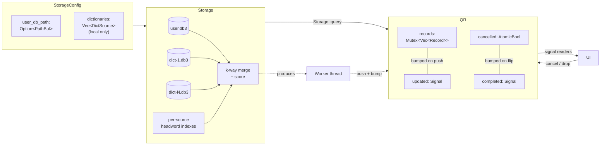

⬆️ [Core](../../.design.md) · ⬇️ [interface](.interface.md) · [tests](.test.md)

# Core::storage Sub-Module — Design (v4)

> **Status:** **proposal v4 for iter-015-core-storage**. Supersedes v1
> (`31141f0`), v2 (`f915cce`), v3 (`48a4669`). No implementation yet.

---

## 0. What changed from v3 (and why)

User feedback on v3:

> *"QueryResult 应该返回一个结果列表，但是可以通过一个 signal 通知调用者，
> 当这个 record list 内容更新了，会收到一个 signal，当所有内容更新结束了，
> 也会有另一个 complete signal."*
>
> *"不需要 DictOnline，storage 只是 local."*

Two additive deltas on top of v3:

1. **`QueryResult` now exposes two signals** that wake event-driven UIs
   without polling: `updated` (bumped every time a record is appended) and
   `completed` (raised exactly once when the worker reaches its terminal
   state — natural finish OR cancel).
2. **No `DictOnline`.** Storage stays strictly local. Online dictionary
   integration, if/when it happens, lives in a different module (probably
   an enrichment Skill in the Agent layer, where IO + retries + rate-limit
   policy belong).

Polling accessors (`len` / `get` / `snapshot` / `is_empty` / `is_finished` /
`was_cancelled` / `wait_for`) all stay unchanged from v3 — the signals are
additive, not a replacement.

Storage's public surface from v3 is **also unchanged** — still exactly two
methods (`new` + `query`). Everything new in v4 lives on `QueryResult` or
in new helper types (`Signal`, `SignalReader`).

---

## 1. Signal abstraction

A **signal** is a monotonic counter + a wake-up primitive. Senders bump it;
receivers can either:

- **Poll**: compare current `count()` against their last-seen value. O(1)
  atomic load. Suits UIs that already have a render loop.
- **Wait**: block on `wait_changed(last_seen, timeout) -> u64` until either
  the count moves past `last_seen` or the timeout expires. Returns the new
  count. Suits worker threads, tests, and platform reactors.

This avoids forcing a callback / channel / async runtime down a synchronous
storage layer's throat. Two simple primitives compose into any pattern the
platform needs.

### 1.1 The data structure

```rust
pub struct Signal { /* opaque: Arc<SignalInner> */ }

struct SignalInner {
    count:   AtomicU64,
    notify:  Mutex<()>,    // pairs with `cv` for wait_changed
    cv:      Condvar,
}

impl Signal {
    pub fn new()                        -> Self;
    pub fn count(&self)                 -> u64;          // O(1) atomic load
    pub fn bump(&self);                                 // count += 1, notify_all
    pub fn wait_changed(&self, last_seen: u64, timeout: Option<Duration>) -> u64;
}

#[derive(Clone)]
pub struct SignalReader { /* opaque: Arc<SignalInner> */ }

impl SignalReader {
    pub fn count(&self)                 -> u64;
    pub fn wait_changed(&self, last_seen: u64, timeout: Option<Duration>) -> u64;
}
```

- `Signal` is the producer-side handle (worker holds it; not exposed to UI).
- `SignalReader` is the consumer-side handle (UI holds it; cheap `Clone`).
- `QueryResult::updated_signal()` and `completed_signal()` return
  `SignalReader`s.

### 1.2 Semantics

| Signal | Initial count | When `bump()` fires | Terminal value |
|---|---|---|---|
| `updated`   | 0 | After each `Record` is appended to `Inner.records` | Equal to `len()` at completion. Never bumped after `completed`. |
| `completed` | 0 | Exactly once, when worker reaches terminal state (natural finish OR cancel) | 1 forever after. Idempotent — extra `bump()`s are not produced. |

So a UI's typical wakeup loop:

```rust
let updated = result.updated_signal();
let completed = result.completed_signal();
let mut last_u = updated.count();
let mut last_c = completed.count();
loop {
    // Block until ANY signal moves. (Helper combinator below — §1.3.)
    Signal::wait_any(&[&updated, &completed], &[last_u, last_c], None);
    let cur_u = updated.count();
    let cur_c = completed.count();
    if cur_u != last_u {
        let new_records = result.snapshot();
        render(new_records);
        last_u = cur_u;
    }
    if cur_c != last_c {
        on_finished(result.was_cancelled());
        break;
    }
}
```

### 1.3 `Signal::wait_any` helper

```rust
impl Signal {
    /// Wait until ANY of the given signals' counts differ from the
    /// corresponding `last_seen`. Returns the index of the first changed
    /// signal (priority by order). Returns `None` on timeout.
    pub fn wait_any(
        signals:   &[&SignalReader],
        last_seen: &[u64],
        timeout:   Option<Duration>,
    ) -> Option<usize>;
}
```

Implementation: a shared `Condvar` registered as a subscriber to each input
signal. v4 implements it by piggybacking on a single shared `Mutex<()>` +
`Condvar` shared across all of a `QueryResult`'s signals (worker holds one
`Condvar` and bumps it whenever any field changes; readers wait on that
condvar regardless of which signal they wanted to wake on).

Open question §11 q.2: this means **`updated` and `completed` share the
wake mechanism** but expose distinct counters. Optimisation: works fine
for `QueryResult` since the producer is the same worker. If we later add
unrelated `Signal`s that need `wait_any`, we'll need a real multi-condvar
broker. Out of scope for iter-015.

---

## 2. Updated `QueryResult` surface

Everything from v3 + two new accessors:

```rust
impl QueryResult {
    // ---- v3 unchanged --------------------------------------------------
    pub fn cancel(&self);
    pub fn is_finished(&self) -> bool;
    pub fn was_cancelled(&self) -> bool;
    pub fn len(&self) -> usize;
    pub fn is_empty(&self) -> bool;
    pub fn get(&self, index: usize) -> Option<Record>;
    pub fn snapshot(&self) -> Vec<Record>;
    pub fn wait_for(&self, min_len: usize, timeout: Option<Duration>) -> usize;

    // ---- v4 additions --------------------------------------------------
    /// Counter that bumps once every time a `Record` is appended.
    /// Initial value 0. Terminal value == `len()` at completion.
    pub fn updated_signal(&self) -> SignalReader;

    /// Counter that bumps exactly once at terminal state (cancel or
    /// natural finish). Initial value 0; terminal value 1.
    pub fn completed_signal(&self) -> SignalReader;
}
```

Both `SignalReader`s are cheap clones of the same `Arc`s the worker owns —
the worker still bumps `updated` after each `records.push(...)` and bumps
`completed` exactly once in its terminal path (whether reached via natural
end-of-merge or via observing the cancel flag).

`wait_for` (the v3 helper) is **NOT** removed. It is just internally
re-implemented in terms of the new signals (`wait_changed` on `updated`
until `len() >= min_len`, with simultaneous awareness of `completed`).

---

## 3. Sequence: typical event-driven UI lifecycle

```mermaid
sequenceDiagram
    participant UI as UI thread
    participant W as Worker thread
    participant QR as QueryResult
    participant US as updated Signal
    participant CS as completed Signal

    UI->>QR: result = Storage::query("app")
    QR->>W: spawn(worker)
    UI->>QR: updated = result.updated_signal()
    UI->>QR: completed = result.completed_signal()
    UI->>UI: last_u = 0; last_c = 0
    loop until completed
        UI->>UI: Signal::wait_any([updated, completed], [last_u, last_c], None)
        alt updated.count() > last_u
            UI->>QR: snap = result.snapshot()
            UI->>UI: render(snap)
            UI->>UI: last_u = updated.count()
            par worker is still producing
                W->>QR: records.push(record_n)
                W->>US: bump()
            end
        else completed.count() > last_c
            UI->>UI: handle done; break
        end
    end
    W->>CS: bump()
```

The producer always bumps `updated` **before** the worker's next iteration
(after the push, before checking cancel). And bumps `completed` as the last
statement of the worker function, immediately before returning.

---

## 4. Cancellation interaction with signals

`QueryResult::cancel()`:

1. Flips `cancelled: AtomicBool`.
2. Bumps `completed` immediately. (UI waiting on `completed_signal` wakes
   right now even if the worker is mid-IO.)
3. Returns. The worker still exits at its own pace (detached), but the UI
   is already unblocked.

This means:

- `completed_signal().count() == 1` **does not** imply the worker has
  finished its OS-level thread cleanup, only that no further records will
  be appended.
- `is_finished()` is `true` once the signal is bumped — same instant.
- `updated_signal()` is guaranteed not to bump after `completed_signal()`
  bumps. (Worker checks `cancelled` before each push; if it's set, it
  skips the push.)

---

## 5. Worker thread lifecycle (revised from v3)

```mermaid
flowchart TD
    Start[query() called] --> Spawn[thread::spawn worker]
    Spawn --> Loop{Got next candidate?}
    Loop -- no more --> Done[set finished=true<br/>bump completed<br/>return]
    Loop -- yes --> Check{cancelled?}
    Check -- yes --> Done2[set finished=true<br/>bump completed<br/>return]
    Check -- no --> Push[lock records, push, unlock]
    Push --> Bump[bump updated]
    Bump --> Loop
```

The check happens **after** the candidate is materialized but **before**
push. So if `cancel()` fires mid-candidate-build, that record is dropped on
the floor (not pushed), and `updated` doesn't bump again. Then `completed`
bumps once.

---

## 6. Local-only constraint (per user)

**Storage is strictly local.** No network IO from this module ever:

- `DictSource` has only two variants — `SeededJson` and `Sqlite` (both
  reading local files).
- `Cargo.toml` for `ee-core` (this sub-module's home) does NOT pull in any
  HTTP client crate.
- `forbid(unsafe_code)` already in `lib.rs`. v4 also intends to add a
  workspace-level lint rule banning `reqwest` / `ureq` / `hyper` / `isahc`
  in `ee-core`'s dependency graph. Implementation detail; called out here
  so design and lint stay consistent.

If/when an online dictionary becomes desirable, it ships as a **Skill**
in the Agent module (Phase 2), which already has the LLM/IO budget
machinery. Storage is not the right home.

`Record` keeps the same three variants from v3: `Dict` / `Note` /
`History`. No new variant.

---

## 7. Architecture (refresh)



---

## 8. Record model (unchanged from v3)

```rust
pub enum Record {
    Dict(DictRecord),
    Note(NoteRecord),
    History(HistoryRecord),
}

pub struct BaseRecord {
    query_term:   String,
    matched_word: String,
    is_exact:     bool,
    score:        f32,
    kind:         RecordKind,
}

pub enum RecordKind { Dict, Note, History }
```

Per-variant payload (`DictRecord`/`NoteRecord`/`HistoryRecord`) and the
underlying `Entry` / `Note` / `HistoryEntry` row types are identical to v3.

---

## 9. Scoring (unchanged from v3)

```text
score(q, w) = max(
    1.0                                                if q.lower() == w.lower(),
    0.95                                               if w.lower().starts_with(q.lower()),
    1.0 - lev(q.lower(), w.lower()) / max(|q|, |w|)
)  clamped to [0.0, 1.0]
is_exact = (score >= 1.0)
```

Records emitted in score-desc order via k-way merge.

---

## 10. Configuration (unchanged from v3; restated)

```rust
pub struct StorageConfig {
    pub user_db_path: Option<PathBuf>,        // None ⇒ in-memory
    pub dictionaries: Vec<DictSource>,        // ≥ 1
}

pub struct DictSource {
    pub id:           String,
    pub display_name: String,
    pub origin:       DictOrigin,
}

pub enum DictOrigin {
    SeededJson { json_path: PathBuf, cache_path: Option<PathBuf> },
    Sqlite     { path: PathBuf },
}
```

---

## 11. Open design questions for reviewer

1. **Single shared Condvar across all signals on one `QueryResult`.** Plan:
   yes, since the producer is one worker. Spurious wakeups are filtered by
   reading the per-signal counter. This is simpler than per-signal Condvars
   at the cost of false wakeups (irrelevant here — there are only 2 signals
   per `QueryResult`). Confirm or push back.

2. **`Signal::wait_any` as a free function on `Signal`** vs a method on
   `SignalReader`. Plan: free fn. Cleaner call site (`Signal::wait_any(&[..],
   &[..], to)`); doesn't bias toward a single "primary" signal.

3. **Should `bump()` be exposed on `Signal`?** Plan: yes — Storage's
   internal worker uses it, but it's `pub` because the type is `pub`. If
   that bothers the surface, gate `Signal::new` and `bump` behind a
   `#[doc(hidden)]` marker or move them to a private newtype. v4 keeps them
   public for symmetry with `count()` / `wait_changed()`.

4. **Reader-only handle (`SignalReader`) instead of just cloning `Signal`.**
   Plan: yes (read/write split). The UI receives `SignalReader` which has
   no `bump()` method — encodes "you can read this, you can't fake an
   update" in the type. Slightly more types; better semantic clarity.

5. **`updated` count semantics**: bump per record (current plan) vs bump
   per batch (worker collects 10 records, then one bump). Per-record is
   simpler and gives the UI per-record dispatch latency. Per-batch reduces
   condvar wake storms. Per-record is fine because the worker is
   serial — there are at most ~tens of pushes/sec for fuzzy queries over
   a few thousand entries.

6. **`completed` bumping exactly once.** Plan: enforced by the worker
   storing a local `bool already_completed`, but also by `cancel()` itself
   using `compare_exchange` on `cancelled` so only the first cancel calls
   bump. Idempotency is critical because UIs may `cancel()` defensively
   in error paths.

7. **No `WaitTimedOut` distinguishable from "saw a real change"** —
   `wait_changed` returns the count, which the caller compares. If timeout
   occurred and no change happened, the return equals `last_seen`. Plan:
   keep simple; UI compares. Alternative: return
   `Result<u64, WaitTimedOut>`. Less ergonomic, more correct.

8. **Worker thread is detached** (drop doesn't join). Same as v3. Confirm
   still acceptable now that signals add inter-thread visibility.

9. **Online dictionaries explicitly out of scope** (per user). `Cargo.toml`
   for `ee-core` should grow no HTTP-client deps as part of iter-015.
   Future online-dict work goes through Skill/Agent, not Storage.

10. **Writes still not addressed** (`notes_set` / `history_record` etc.).
    Same as v3 open q.1: live in a separate sub-module / module / iter,
    not on `Storage`. Reviewer call required before iter-015 implementation
    starts.

11. **`Signal::wait_any` priority on ties**: if two signals both have
    changed by the time `wait_any` re-locks, the *first* in the input
    slice wins (returns its index). Documented behaviour. UI typically
    puts `completed` last so an "updated AND completed in one tick"
    delivers one final paint before tear-down.
