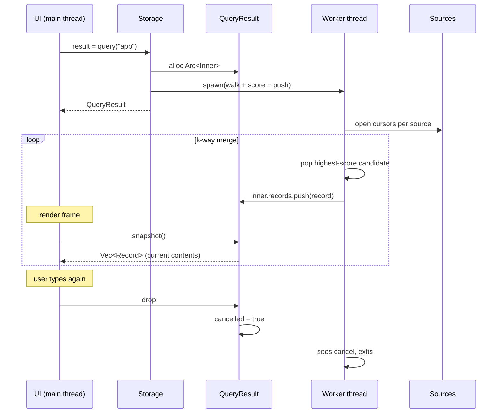

⬆️ [Core](../../.design.md) · ⬇️ [interface](.interface.md) · [tests](.test.md)

# Core::storage Sub-Module — Design (v3)

> **Status:** **proposal v3 for iter-015-core-storage**. Supersedes v1
> (`31141f0`) and v2 (`f915cce`). No implementation yet.

---

## 0. What changed from v2 (and why)

User's review of v2:

> *"only 2 function is enough. 构造函数，加载 config 来 load db。
> query，输入任何字符，可以被主动取消执行，返回的结果是一个内容可变的结果 list."*

v3 collapses Storage's **public surface to exactly two methods**:
`Storage::new(config)` + `Storage::query(term)`. Everything else either
disappears or moves behind `QueryResult`'s accessor methods.

What this changes from v2:

| v2 had | v3 has |
|---|---|
| 16 `Storage::*` methods | **2** (`new` + `query`) |
| `QueryHandle: Iterator<Item=Record>` (pull) | **`QueryResult`** (push: background worker appends to an internal `Vec<Record>`; UI polls `len/get/snapshot`) |
| `QueryOptions` / `FirstYieldPolicy` | none — `query(term: &str)` only |
| `notes_set` / `notes_remove` / `history_record` / `history_clear` | **gone from this module** (see §10 q.1) |
| `notes_iter` / `history_iter` / counts / `dict_meta` | **gone from this module** |
| `Storage::in_memory` constructor | folded into `StorageConfig` (`user_db_path: Option<PathBuf>` + `cache_path: Option<PathBuf>` — `None` ⇒ in-memory) |

What v3 keeps from v2 unchanged:

- `Record` enum + `BaseRecord` (§3)
- Multi-dictionary support (`StorageConfig.dictionaries: Vec<DictSource>`)
- Scoring formula (max of exact / prefix / 1-norm-Levenshtein)
- `StorageError` variants
- WAL + per-file SQLite

---

## 1. Responsibility

`Core::storage` is the **read interface** to all persistent data: every
loaded offline dictionary, the user's notes, the user's history. It exposes
exactly two operations: open everything (constructor) + fuzzy-search
everything (query). It owns no UI concept, no scheduling policy beyond
"work in the background until cancelled".

Notes and history are **read** through `query()` like any other source.
Writing to them is **not** this module's job in iter-015. The user's review
of v2 explicitly omitted writes from the 2-function surface; see §10 q.1
for who owns writes.

---

## 2. Architecture

```mermaid
flowchart LR
    subgraph cfg["StorageConfig"]
        UD["user_db_path:<br/>Option&lt;PathBuf&gt;"]
        DL["dictionaries:<br/>Vec&lt;DictSource&gt;"]
    end

    subgraph storage["Storage"]
        direction TB
        UC[(user.db3<br/>notes + history<br/>read-only here)]
        D1[(dict-1.db3<br/>read-only)]
        DN[(dict-N.db3<br/>read-only)]
        Idx[per-source<br/>headword indexes]
        UC --> Engine
        D1 --> Engine
        DN --> Engine
        Idx --> Engine
        Engine[k-way merge<br/>+ score]
    end

    cfg --> storage
    storage -->|Storage::query| QR[QueryResult<br/>(Arc&lt;Inner&gt;)]
    QR -. background worker .-> Engine
    QR -->|len/get/snapshot| UI
    UI -->|cancel / drop| QR
    QR -->|cancel flag| Engine
```

`Storage::query` spawns ONE background thread per query. The thread walks
sources, merges by score, and appends each `Record` to an `Arc<Mutex<Vec<Record>>>`
that `QueryResult` exposes through read-only accessors.

---

## 3. Record model

Identical to v2. Re-stated for completeness:

```
                    ┌───────────────────┐
                    │  Record (enum)    │
                    └────────┬──────────┘
              ┌──────────────┼──────────────┐
              ▼              ▼              ▼
       DictRecord     NoteRecord    HistoryRecord
              │              │              │
              └──────────────┼──────────────┘
                             ▼
                       BaseRecord {
                         query_term,        // what the user typed (trimmed)
                         matched_word,      // canonical word in source
                         is_exact,          // score >= 1.0
                         score,             // 0.0..=1.0
                         kind,              // tag duplicating the variant
                       }
```

Why enum: closed set, no vtable, exhaustive `match`. Downcast through
`record.as_dict()` / `.as_note()` / `.as_history()` (returns `Option<&_>`).

`BaseRecord` is identical across variants so generic UI code can read
score / exactness / kind without matching on the variant.

---

## 4. The two functions

### 4.1 Constructor

```rust
Storage::new(config: StorageConfig) -> Result<Self, StorageError>
```

- Opens the user db (`config.user_db_path` — `None` means `:memory:`).
- Opens each `DictSource` in `config.dictionaries`:
  - `Sqlite{path}`: attach the existing file (must be schema-compatible).
  - `SeededJson{json_path, cache_path}`: if `cache_path` is `Some(p)` and
    `p` exists with a matching `seed_hash`, attach it. Otherwise read
    `json_path`, build a fresh SQLite (in-memory if `cache_path` is `None`),
    insert all entries in one tx, stamp `seed_hash`.
- Builds in-memory headword indexes per dict for fuzzy candidate generation.
- Runs forward schema migrations per file as needed.
- Returns once every source is ready to query.

Errors short-circuit. Either the whole thing opens or none of it does.

### 4.2 Query

```rust
Storage::query(&self, term: &str) -> QueryResult
```

- Trims `term`. If the trimmed term is empty, returns a `QueryResult` that
  immediately reports `is_finished == true`, `len == 0`.
- Allocates an `Arc<Inner>` holding:
  - `records: Mutex<Vec<Record>>`     (the mutable list)
  - `cancelled: AtomicBool`
  - `finished: AtomicBool`
  - `worker_join: Mutex<Option<JoinHandle<()>>>`
- Spawns a worker thread with a clone of the `Arc`.
- Worker walks sources in k-way merge by score, periodically checks
  `cancelled`, pushes each `Record` into the locked Vec, sets `finished`
  when done.
- Returns the `QueryResult { inner: Arc<Inner> }` immediately.

No blocking. No options. No callbacks. UI polls.

---

## 5. The result list — `QueryResult`

`QueryResult` is the only side-effecting handle to a running query. Its job
is to expose the growing record list AND a single cancel knob.

```rust
pub struct QueryResult { /* Arc<Inner> */ }

impl QueryResult {
    pub fn cancel(&self);                             // idempotent
    pub fn is_finished(&self) -> bool;                // cancelled OR naturally done
    pub fn was_cancelled(&self) -> bool;              // only true if cancel() flipped it
    pub fn len(&self) -> usize;
    pub fn is_empty(&self) -> bool;
    pub fn get(&self, index: usize) -> Option<Record>;
    pub fn snapshot(&self) -> Vec<Record>;            // clone of full list
    pub fn wait_for(&self, min_len: usize, timeout: Option<Duration>) -> usize;
}

impl Drop for QueryResult {
    fn drop(&mut self) { self.cancel(); }             // RAII cancel
}
```

Notes:

- `len` / `get` / `is_empty` are O(1) reads under a short Mutex lock.
- `snapshot` is O(n) clone — meant for "render the whole list this frame".
  Cheap because `Record` is small (~hundreds of bytes worst case).
- `wait_for(min, timeout)` exists for tests and for UI patterns that prefer
  blocking with a deadline. It uses a `Condvar` notified on every append /
  cancel / finish.
- `cancel` flips a flag the worker checks between rows. The worker thread
  is **detached** with respect to drop — `Drop` flips the flag and returns;
  the worker exits at its own pace (usually within microseconds since the
  check is on the hot path).

---

## 6. Sequence: typical UI lifecycle



The UI's responsibility:

1. Render based on `snapshot()` once per frame.
2. Drop the old `QueryResult` (or call `cancel()`) when the user changes the input.
3. Call `Storage::query(new_term)` to start a fresh search.

Storage has no opinion on UI threading. The platform crate decides.

---

## 7. Scoring (unchanged from v2)

```text
score(q, w) = max(
    1.0                                     if q.lower() == w.lower(),
    0.95                                    if w.lower().starts_with(q.lower()),
    1.0 - lev(q.lower(), w.lower()) / max(|q|, |w|)
)  clamped to [0.0, 1.0]

is_exact = (score >= 1.0)
```

Same formula across `dict` / `note` / `history`. Ordering across sources is
meaningful because the y-axis is the same.

Records emitted in score-desc order via k-way merge — the result list is
always sorted by score from index 0 down. UI doesn't re-sort.

---

## 8. Configuration

```rust
pub struct StorageConfig {
    /// User database (notes + history). None ⇒ :memory: (test mode).
    pub user_db_path: Option<PathBuf>,

    /// At least one source. Vector order = priority (used only as
    /// tie-breaker between identical-score records).
    pub dictionaries: Vec<DictSource>,
}

pub struct DictSource {
    pub id:           String,        // kebab-case, unique within config
    pub display_name: String,        // shown to user; not used internally
    pub origin:       DictOrigin,
}

pub enum DictOrigin {
    /// Read json_path on first open; cache parsed contents to cache_path
    /// (None ⇒ :memory: cache, rebuilt each open).
    SeededJson {
        json_path:  PathBuf,
        cache_path: Option<PathBuf>,
    },

    /// Open an existing SQLite file (read-only).
    Sqlite { path: PathBuf },
}
```

Tests use `user_db_path: None` and `cache_path: None`. Production sets both.
**No separate `Storage::in_memory` method** — configuration drives everything.

---

## 9. Concurrency, lifecycle, failure

- `Storage` is `Send + Sync`. Internally one `Mutex<Connection>` per opened file.
- `Storage::query` is cheap (~µs): allocates `Arc<Inner>`, spawns thread, returns.
- One worker thread per active `QueryResult`. Released on cancel or natural finish.
- `QueryResult` is `Send + Sync` (the underlying `Arc<Inner>` is). Cloning
  the QueryResult is **not exposed** — there's exactly one canonical handle;
  cancel-from-elsewhere is achieved by holding an `Arc<QueryResult>` (or by
  splitting via `QueryResult::cancel_handle() -> CancelHandle` if §10 q.6 is
  taken; current plan does NOT include cancel_handle to keep surface minimal).
- Worker thread errors land in a private `errors: Mutex<Vec<StorageError>>`
  inside `Inner`. They are NOT exposed in v3's public surface. If a source
  errors, that source's contribution stops; other sources continue. Open
  question §10 q.4.

---

## 10. Open design questions for reviewer

1. **Writes**. v3 has no `notes_set` / `notes_remove` / `history_record` /
   `history_clear`. Confirm one of:
   - **(a)** Writes live in a separate sub-module (`Core::mutations` or
     similar). Storage stays read-only.
   - **(b)** Writes come back as a third Storage method
     (`Storage::apply_mutation(Mutation)` style enum).
   - **(c)** Writes are deferred to a later iter entirely; the iter-015 app
     can read but not author notes/history.
   - I'm drafting iter-015's downstream consumers assuming **(a)**. Push
     back if it should be (b) or (c).

2. **Empty query**. `Storage::query("")` returns an empty, immediately-finished
   `QueryResult`. Alternative: yields *everything* (every dict entry + every
   note + every history record). Plan: empty input ⇒ empty result. UI uses
   a different code path for "show all".

3. **Empty `dictionaries` vector**. Plan: `Storage::new` returns
   `EmptyConfig`. A translator with zero dictionaries can't translate;
   notes alone don't justify the module.

4. **Per-source errors during query**. Plan: silently absorbed (worker logs
   to a private vec; that source contributes nothing further; other sources
   continue). Alternative: surface via `QueryResult::errors() -> Vec<...>`.
   v3 hides them to keep the surface 2-method-clean. If you want them
   visible, name it now.

5. **`wait_for(min_len, timeout)` in `QueryResult`**. Plan: keep it,
   because tests rely on synchronous deterministic waits. It is not strictly
   one of the "2 functions" but it is on the result handle, not on Storage,
   so the storage surface stays at 2. Open to dropping it (tests would have
   to spin-poll, ugly).

6. **No `cancel_handle()` for cross-thread cancel from another owner**. v2
   exposed `CancelToken: Clone + Send + Sync`. v3 omits it. If the UI keeps
   the `QueryResult` on a worker thread, it loses the ability to cancel
   from the main thread. Workaround: hold an `Arc<QueryResult>` shared
   between threads (cancel is `&self`). Alternative: re-introduce
   `CancelHandle` later if needed.

7. **One thread per query vs shared thread pool**. Plan: one
   `std::thread::spawn` per `Storage::query`. A typing user fires ~1 query
   per keystroke (with cancels overlapping). Per-query thread is wasteful
   under high QPS but lets each query start instantly. A small thread pool
   (e.g. `rayon` or hand-rolled) is a later optimisation.

8. **Worker thread `Drop` semantics**. Plan: cancel-and-detach. Drop flips
   the flag and returns; the OS reaps the worker once it sees the flag.
   Alternative: block in Drop until join. The blocking variant guarantees
   no leakage of work after Drop but punishes UI responsiveness if the
   worker is mid-IO. Plan stays detached.

9. **Record dedup across dicts**. Plan: no dedup (each dict yields its own
   `DictRecord` for the same headword; UI may dedup). Same as v2.

10. **`Record` and `BaseRecord` field set**. Plan: `query_term` /
    `matched_word` / `is_exact` / `score` / `kind`. Considered also
    including `dict_priority: u32` for tie-breaking — kept out because
    `BaseRecord` is supposed to be source-agnostic; tie-break happens
    deeper.

11. **Snapshot vs subscribe**. Plan: `snapshot()` (UI polls every frame).
    Alternative: callback / channel ("notify me when a record is added").
    Polling matches UI render loops and keeps the surface tiny. Callbacks
    require cross-thread dispatch and lifetime juggling.

12. **`Storage::new` is sync (blocks until all sources open)**. Alternative:
    return immediately with a `Storage` that reports `is_ready() -> bool`
    and lazily opens sources on first `query`. Plan stays sync: opening
    sources at startup amortises cost and surfaces config errors at startup
    rather than mid-typing.
