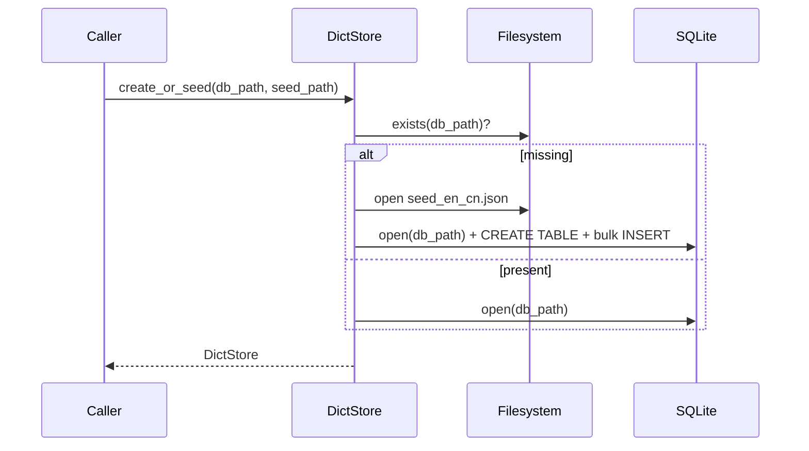
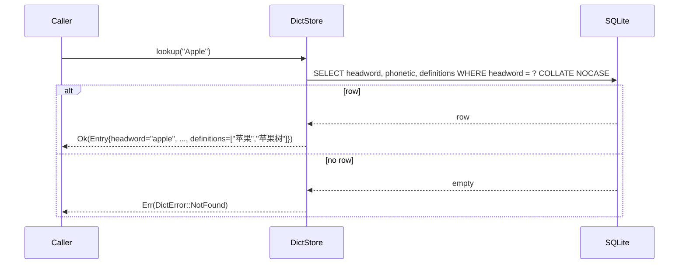

⬆️ [EasyEnglish](../.design.md) · ⬇️ (no submodules yet — see [`.interface.md`](.interface.md) for planned public types)

# Dict Module — Design

The `Dict` module owns the **offline English→Chinese dictionary** that ships with
EasyEnglish. It is the only crate in the workspace allowed to touch SQLite directly.

> **Phase 1 status:** Implementation lands in iter-013. Phase 1 only asserts the
> module's identity, dependencies, and contracts.

---

## 1. Responsibility

1. Hold the bundled seed dataset (`Dict/data/seed_en_cn.json`) — a hand-curated list of
   common English words with phonetics and one or more Chinese senses.
2. Materialise the seed into a SQLite database on first use, then expose fast read
   operations:
   - **exact lookup** (case-insensitive)
   - **fuzzy suggest** (Levenshtein over an in-memory cache of all headwords)
3. Hide every implementation detail of rusqlite behind the `DictStore` type.

The module **does not** know about UI, OS APIs, networking, history, notes, or any
other application concern. Those live in `Core` (or the platform crates).

---

## 2. Data Model

<details>
<summary><strong>Entry — primary data record</strong></summary>

| Field | Type | Description |
|---|---|---|
| `headword` | `String` | Lower-cased canonical form (matches `entries.headword`) |
| `phonetic` | `String` | IPA notation, may be empty |
| `definitions` | `Vec<String>` | Chinese senses, in display order; never empty for a hit |

</details>

---

## 3. SQLite Schema

<details>
<summary><strong>Schema (single table)</strong></summary>

```sql
CREATE TABLE IF NOT EXISTS entries (
    headword     TEXT PRIMARY KEY COLLATE NOCASE,
    phonetic     TEXT NOT NULL DEFAULT '',
    definitions  TEXT NOT NULL  -- JSON array of Chinese gloss strings
);

CREATE INDEX IF NOT EXISTS idx_entries_headword_nocase
    ON entries(headword COLLATE NOCASE);
```

</details>

The `definitions` column intentionally stores JSON: it keeps the row count equal to the
word count (easier for stats and migrations) and avoids a child table for what is
effectively a small ordered list. Parsing cost is negligible at this scale (~200 words).

---

## 4. Key Workflows

### 4.1 First-time open



### 4.2 Lookup



### 4.3 Suggest (fuzzy)

In-memory cache of all lower-cased headwords (built at `open`) → Levenshtein distance
to query → stable sort by `(distance, headword)` → take first `max`. Iter-013 lands the
actual implementation; this matches the v0.3.0 behavior the previous C++ build had.

---

## 5. Performance budget

- `open` of a populated DB: < 50 ms (cache build is dominant cost; ≤ 200 entries)
- `lookup` p99: < 1 ms on warmed prepared statement
- `suggest("appl", 10)`: < 5 ms on 200-entry corpus

iter-013 will add a benchmark target if these budgets become contentious.
