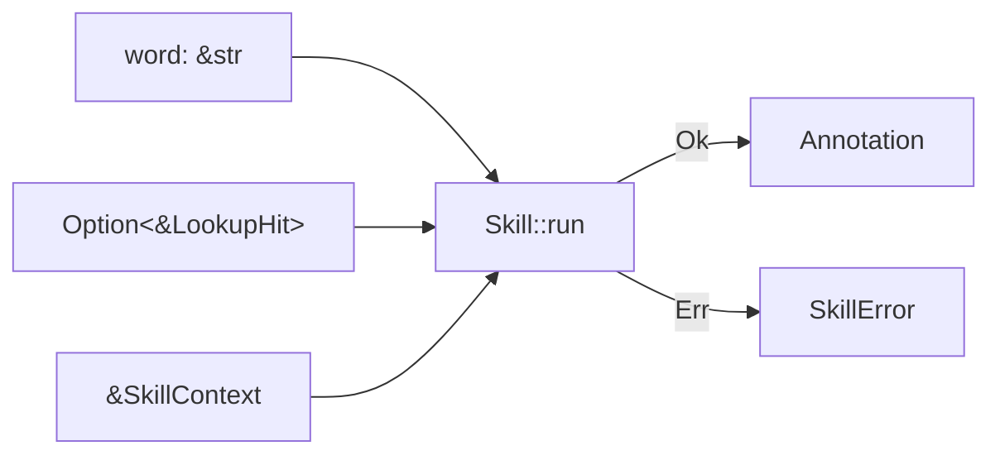
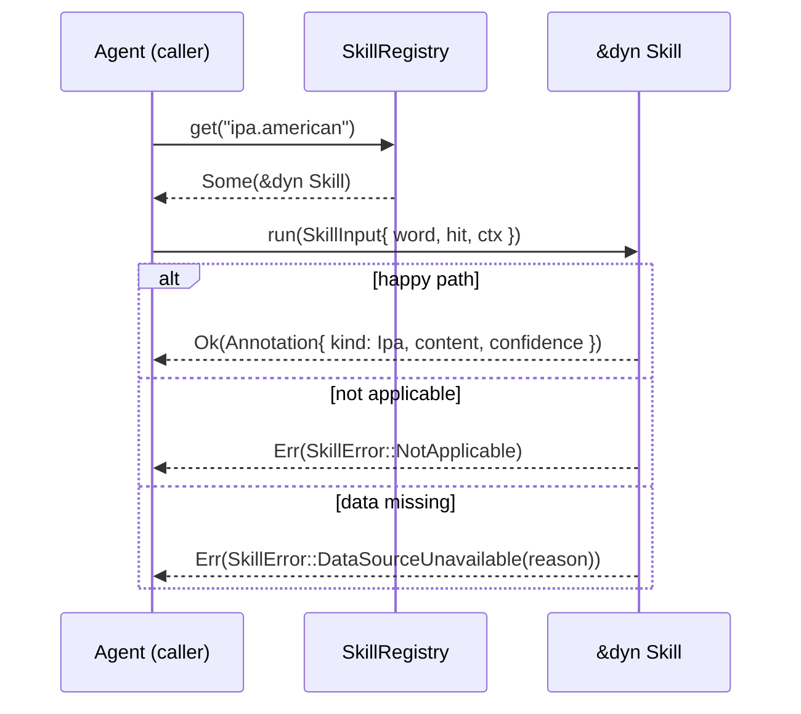
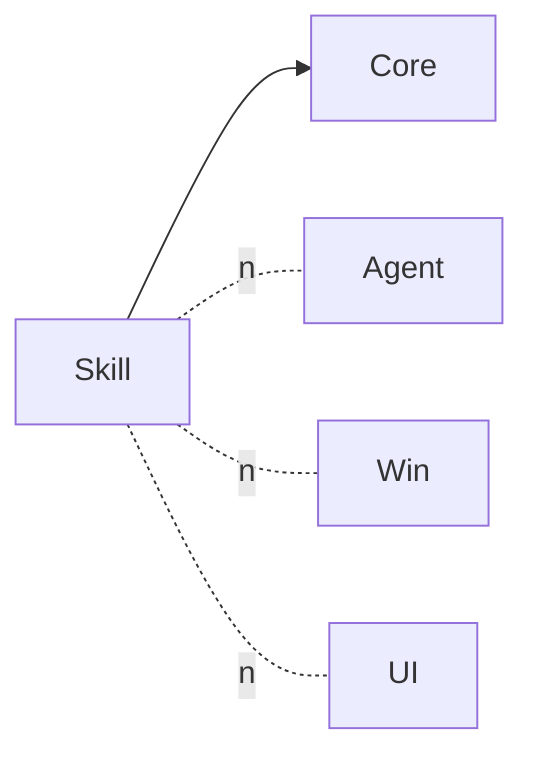

⬆️ [EasyEnglish](../.design.md) · ⬇️ [tests](tests/.test.md)

# Skill Module — Design

> **Status:** **proposal for iter-015**. No implementation yet. Approval of
> this file + `.interface.md` is the gate before any Rust lands.

The `Skill` module is the **unit of extension** for everything beyond raw
dictionary lookup. A *Skill* takes a word (+ optionally the `LookupHit` Core
already produced) and returns **one `Annotation`** — IPA, examples, etymology,
synonyms, a formality note, a custom translation, etc.

`Skill` is consumed by the `Agent` module (see `Agent/.design.md`). On its
own, Skill knows nothing about orchestration, ordering, user preferences, or
LLM transport — those concerns live one level up.

---

## 1. Responsibility

`Skill` owns three orthogonal things:

| File | Responsibility |
|---|---|
| `skill.rs` | The `trait Skill` + `SkillInput` / `SkillContext` / `SkillError` types |
| `annotation.rs` | `Annotation` + `AnnotationKind` (the data UI eventually renders) |
| `registry.rs` | `SkillRegistry` — register, lookup-by-id, listing |
| `builtin/*.rs` | Stub built-in skills (`ipa.american`, `examples.5`, `etymology`, `synonyms`, `formality.note`). Each is a known ID with `SkillError::DataSourceUnavailable("…")` body. They prove the registry shape; real bodies land in later iters. |

Skill knows nothing about: `Agent`, `Instructions`, threading, UI, OS,
networking. (A future LLM-backed skill will pull in `httplib` / `reqwest`
inside its own module, never leaking through the trait.)

---

## 2. The `Skill` abstraction

Key shape decisions:

- **`trait Skill` is object-safe.** `&dyn Skill` lives in `SkillRegistry` and
  is what `Agent` calls. No generic methods, no associated types.
- **Sync, not async.** Phase 1 skills are pure or hit local data. Phase 2
  LLM-backed skills will block the calling thread; the platform layer runs
  Agent on a worker thread so this is fine. If we ever stream tokens we
  rev the trait under a new module name.
- **One Annotation per run.** A skill that conceptually returns "5 examples"
  packs them into one `Annotation::Examples` (content is a serialised list or
  newline-joined). A skill that wants two semantically different outputs
  (e.g. IPA + audio URL) splits into two skills.
- **Skills must never panic.** All failure goes through `SkillError`. The
  registry's contract test asserts this for every built-in.

### Skill identity

Each skill has a stable `id: &str` of the form `"namespace.name"`:

| ID pattern | Example | Meaning |
|---|---|---|
| `ipa.<variant>` | `ipa.american`, `ipa.british` | IPA pronunciation |
| `examples.<N>` | `examples.3`, `examples.5` | N example sentences |
| `etymology` | `etymology` | Single-paragraph etymology |
| `synonyms.<scope>` | `synonyms.same-register` | List of synonyms |
| `formality.note` | `formality.note` | One-line register/formality note |
| `custom.<your>.<name>` | `custom.acme.glossary` | Anything user/plugin-defined |

Versioning: if a skill's output shape changes incompatibly, register under a
new id (`examples.5` → `examples.5.v2`). Never silently re-shape.

---

## 3. Sequence: a registered skill runs

`Agent` decides what to do with each variant — see `Agent/.design.md` §4.

---

## 4. Dependency rule

- Skill **depends on** `ee-core` (for `LookupHit`).
- Skill **must not** depend on `ee-agent` (cycle).
- Skill **must not** depend on `Win` / `Mac` / `Linux` / any UI lib.
- Built-in skills that need data sources (dict-derived IPA, online APIs)
  declare those deps **inside Skill's `Cargo.toml`**, not Core's.

`tools/check_core_no_ui.py` will extend to also check
`tools/check_skill_layer.py` once iter-015 lands.

---

## 5. Failure model

| Variant | Meaning | Agent's response (see Agent §4) |
|---|---|---|
| `NotApplicable` | Skill knew it could not help this word (e.g. IPA for emoji input) | Drop silently, don't surface to user |
| `DataSourceUnavailable(reason)` | Network, file, db not reachable | Collect into `AgentResult.errors`, continue with other skills |
| `Cancelled` | Caller (Agent) cancelled mid-flight via budget | Collect, mark partial |
| `Internal(msg)` | Bug or unexpected state in the skill | Collect, **and** log; treat as soft failure |

`SkillError` is **not** `From<std::io::Error>` — implementers wrap explicitly
so the message is human-readable.

---

## 6. Performance budget

- `SkillRegistry::get`: `HashMap<String, Box<dyn Skill>>`, O(1).
- A pure skill (e.g. `formality.note` looking at the dict entry's tags):
  microseconds.
- An LLM-backed skill (future): caller measures via `AgentResult.took_ms`.
  Skill itself has no internal timeout — that's Agent's job.

---

## 7. Open design questions for reviewer

1. **`Annotation.confidence: f32`** — do we expose this in v1, or wait until
   we have a real LLM skill that actually computes one? Currently planned to
   ship as 1.0 for deterministic skills, opt-in for others. If you'd rather
   drop the field until needed, say so before iter-015.
2. **Where does `SkillContext` live?** It carries `region / level / formality`
   which are *also* fields on `Instructions` in Agent. Two options:
   a. Skill defines `SkillContext` as its own struct; Agent constructs one
      per call from Instructions. (current plan — keeps Skill self-contained)
   b. Skill re-exports `ee-agent::Instructions` directly. (creates a cycle,
      rejected.)
   c. Both Skill and Agent import a tiny `ee-prefs` crate. (over-engineered
      for 3 enums; revisit if the set grows.)
3. **Builtin skills as stubs vs not shipped at all** — current plan ships
   them as `DataSourceUnavailable("not implemented yet")` stubs so the
   registry has a known, documented ID surface from day one. Alternative:
   ship an empty registry, let later iters add. Tradeoff is whether the UI
   can render a "skills picker" before iter-016 finishes.
4. **Plugin loading (dlopen / .so / .dll)** — explicitly **out of scope** for
   this iter. All skills are compile-time-linked.
