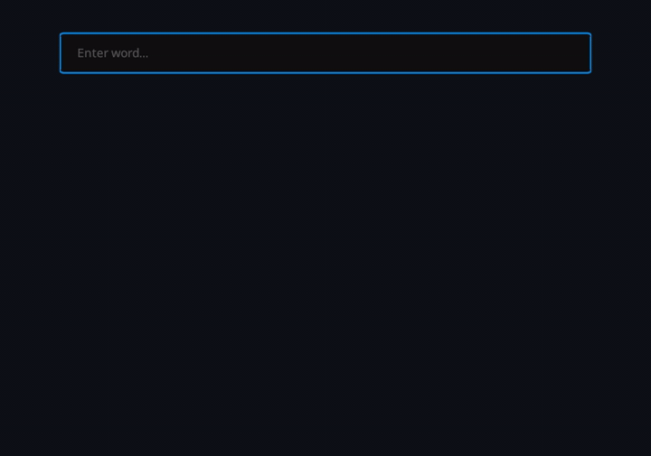

[ English](../README.md) · [ 中文](README.zh-CN.md) · [ 繁體中文](README.zh-HK.md) · [ Español](README.es.md) · [ 日本語](README.ja.md) · [ 한국어](README.ko.md) · [ Português](README.pt-BR.md) · [ Bahasa Indonesia](README.id.md) · [ العربية](README.ar.md) · [ Tiếng Việt](README.vi.md) · [ हिन्दी](README.hi.md) ·  Français

# EasyEnglish

EasyEnglish est un dictionnaire de bureau léger et facile à utiliser pour traduire entre l'anglais et d'autres langues.

Appuyez sur <kbd>Alt</kbd> + <kbd>`</kbd> pour afficher la fenêtre.

## Prise en charge des langues

<table style="width: 100%; table-layout: fixed;">
    <thead><tr><th>Langue</th><th>Nom natif</th><th>Windows</th><th>Linux</th><th>MacOS</th></tr></thead>
  <tbody>
    <tr><td>Chinois mandarin</td><td>中文</td><td>✅ <a href="https://github.com/DexterDreeeam/EasyEnglish/releases/download/EasyEnglish-1.1.0/EasyEnglish-1.1.0-CN.exe">Download</a></td><td>❌ TBD</td><td>❌ TBD</td></tr>
    <tr><td>Chinois traditionnel</td><td>繁體中文</td><td>✅ <a href="https://github.com/DexterDreeeam/EasyEnglish/releases/download/EasyEnglish-1.1.0/EasyEnglish-1.1.0-HK.exe">Download</a></td><td>❌ TBD</td><td>❌ TBD</td></tr>
    <tr><td>Espagnol</td><td>Español</td><td>✅ <a href="https://github.com/DexterDreeeam/EasyEnglish/releases/download/EasyEnglish-1.1.0/EasyEnglish-1.1.0-ES.exe">Download</a></td><td>❌ TBD</td><td>❌ TBD</td></tr>
    <tr><td>Japonais</td><td>日本語</td><td>✅ <a href="https://github.com/DexterDreeeam/EasyEnglish/releases/download/EasyEnglish-1.1.0/EasyEnglish-1.1.0-JP.exe">Download</a></td><td>❌ TBD</td><td>❌ TBD</td></tr>
    <tr><td>Coréen</td><td>한국어</td><td>✅ <a href="https://github.com/DexterDreeeam/EasyEnglish/releases/download/EasyEnglish-1.1.0/EasyEnglish-1.1.0-KR.exe">Download</a></td><td>❌ TBD</td><td>❌ TBD</td></tr>
    <tr><td>Portugais (Brésil)</td><td>Português (Brasil)</td><td>✅ <a href="https://github.com/DexterDreeeam/EasyEnglish/releases/download/EasyEnglish-1.1.0/EasyEnglish-1.1.0-PT-BR.exe">Download</a></td><td>❌ TBD</td><td>❌ TBD</td></tr>
    <tr><td>Indonésien</td><td>Bahasa Indonesia</td><td>✅ <a href="https://github.com/DexterDreeeam/EasyEnglish/releases/download/EasyEnglish-1.1.0/EasyEnglish-1.1.0-ID.exe">Download</a></td><td>❌ TBD</td><td>❌ TBD</td></tr>
    <tr><td>Arabe</td><td>العربية</td><td>✅ <a href="https://github.com/DexterDreeeam/EasyEnglish/releases/download/EasyEnglish-1.1.0/EasyEnglish-1.1.0-AR.exe">Download</a></td><td>❌ TBD</td><td>❌ TBD</td></tr>
    <tr><td>Vietnamien</td><td>Tiếng Việt</td><td>✅ <a href="https://github.com/DexterDreeeam/EasyEnglish/releases/download/EasyEnglish-1.1.0/EasyEnglish-1.1.0-VI.exe">Download</a></td><td>❌ TBD</td><td>❌ TBD</td></tr>
    <tr><td>Hindi</td><td>हिन्दी</td><td>✅ <a href="https://github.com/DexterDreeeam/EasyEnglish/releases/download/EasyEnglish-1.1.0/EasyEnglish-1.1.0-HI.exe">Download</a></td><td>❌ TBD</td><td>❌ TBD</td></tr>
    <tr><td>Français</td><td>Français</td><td>✅ <a href="https://github.com/DexterDreeeam/EasyEnglish/releases/download/EasyEnglish-1.1.0/EasyEnglish-1.1.0-FR.exe">Download</a></td><td>❌ TBD</td><td>❌ TBD</td></tr>
  </tbody>
</table>
